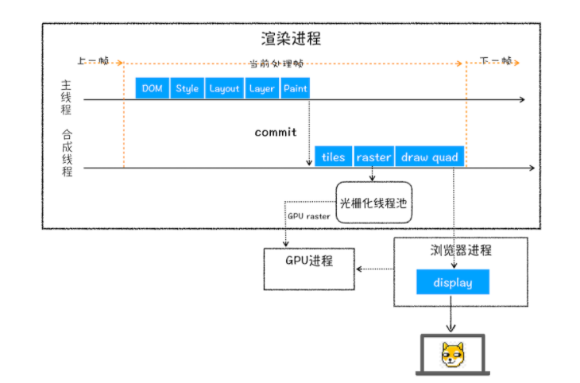
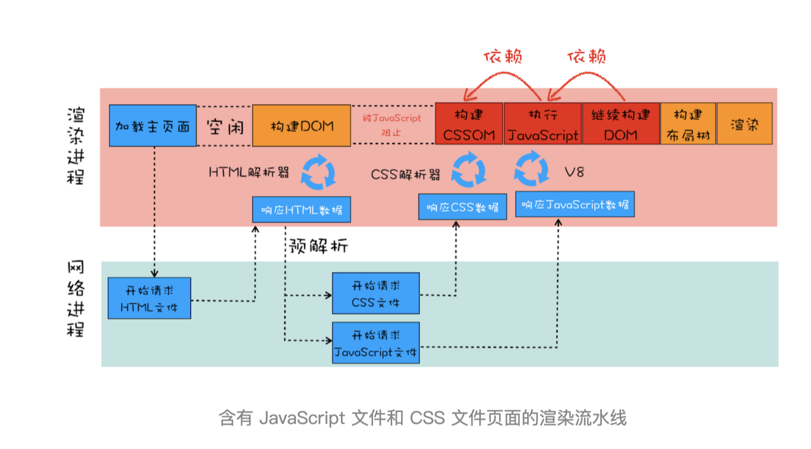

# 渲染流程
## 渲染流水线

## 1. HTML 转化成DOM树
### 构建流程
1. 网络进程接收到响应头的content-type字段为html的时候，就会请求选择或创建一个管道
2. 渲染进程准备好后，会建立一个共享的数据管道
3. 当网络进程接收到数据以后，就会将数据送入管道中
4. 渲染进程的动态的从管道中接收字节流，进行词法分析，解析成DOM节点，然后添加到DOM树中
5. 当包含了CSS的引用的时候，需在先构建CSSOM树，而JS又可以改变CSS，所以执行JS依赖于CSSOM树
6. 当执行到了JS的脚本，暂停整个DOM的解析，JavaScript引擎介入并执行这段脚本，之后继续解析
### DOM构建流程图

### 构建中的优化
1. JS文件下载会阻塞DOM的解析，Chrome在接收到字节流的时候，添加了预解析的流程，开启预解析线程，分析HTML中的JS,CSS文件，然后提前下载JS CSS 文件
2. 也可以使用CDN，或者压缩JS文件体积来加速JS文件的下载
3. 如果JS没有操作DOM的代码，可以设置JS脚本设置为异步加载
4. 对于大的CSS，可能拆分多个不同用途的CSS文件，这样在特定的场景才会加载特定的CSS文件
## 2. 构建CSSOM 树
1. 将CSS文本转换成styleSheets(样式表)结构中的数据
   - CSS来源
     - 通过link引用外部CSS文件
     - \<style\>标记内的CSS
     - 元素style属性内嵌的CSS
2. 转换样式表中的属性值，使其标准化(如将所有的em解析成px，颜色解析成rgb)
3. 计算出DOM树每个节点的具体样式
   - CSS的继承规则
   - CSS的层叠规则
## 3. 布局阶段
1. 创建布局树(渲染树)
   1. 遍历DOM树中所有可见节点，并将这些节点加到布局树种
   2. 不可见的节点将忽略，如head下面的全部内容
2. 布局计算
   1. 计算不布局树节点的坐标位置
## 4. 分层
1. 生成图层树
   1. 拥有层叠上下文属性的元素会被提升为单独一层
   2. 需要剪裁的地方也会被创建为图层
## 5. 图层绘制
渲染引擎会把一个图层的绘制拆分成很多小的绘制指令，然后把这些指令按照顺序组成待绘制列表
 (绘制列表只用来记录绘制顺序和绘制指令)
## 6. 光栅化
1. 当图层的绘制列表完成后，主线程会将列表提交给合成线程
2. 合成线程会将图层划分为图块，然后按照视口附近的图块通知渲染进程生成位图
3. 渲染进程维护一个栅格化线程池，生成位图的操作是有栅格化线程来执行。而图块是栅格化执行的最小单位
4. 若有GPU，渲染进程会把生成图块的指令发给GPU，然后GPU生成图块的位图，并保存在GPU中
## 7. 合成
1. 当所有图块被光栅化之后，合成线程就会生成一个绘制图块的命令(DrawQuad)，然后提交给浏览器进程
2. 浏览器进程将其页面内容绘制到内存中，最后显示在屏幕上