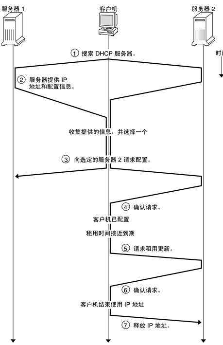
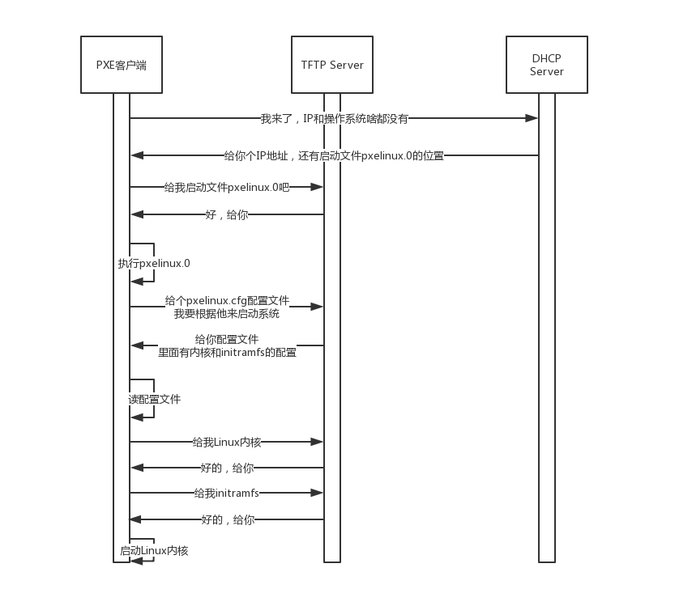

# DHCP
## DHCP 简介
动态主机配置协议（Dynamic Host Configuration Protocol），简称DHCP

### DHCP优点
1. 网络管理员可以验证IP地址和其它配置参数，而不用去检查每个主机
2. DHCP不会同时租借相同的IP地址给两台主机
3. DHCP管理员可以约束特定的计算机使用特定的IP地址
4. 可以为每个DHCP作用域设置很多选项
5. 客户机在不同子网间移动时不需要重新设置IP地址

### DHCP缺点
1. DHCP不能发现网络上非DHCP客户机已经在使用的IP地址
2. 当网络上存在多个DHCP服务器时，一个DHCP服务器不能查出已被其它服务器租出去的IP地址
3. DHCP服务器不能跨路由器与客户机通信，除非路由器允许BOOTP转发
（BOOTP全称Bootstrap Protocol，引导程序协议，基于IP/UDP协议，是DHCP的前身，用于无盘工作站的局域网中，可以让无盘工作站从一个中心服务器上获得IP地址）

## DHCP工作过程
1. DHCP Discover：新来的机器（DHCP客户机）使用IP地址0.0.0.0发送了一个DHCP discover的广播包，用于寻找DHCP服务器。广播包封装了UDP，UDP封装了BOOTP，目的IP地址为255.255.255.255。网络上每一台安装了TCP/IP协议的主机都会接收到这种广播信息，但只有DHCP服务器才会做出响应。
2. DHCP Offer：DHCP服务器收到DHCP discover后，挑选尚未出租的IP地址分配给DHCP客户机。同时，DHCP Server为此客户保留为它提供的IP地址，从而不会为其他DHCP客户分配此IP地址。DHCP Server仍然使用广播地址作为目的地址。此时请求分配IP的新人还没有自己的IP。除此之外，服务器还发送了子网掩码、网关和IP地址租用期等信息。
3. DHCP Request：DHCP客户机选择其中一个DHCP offer（可能有多台服务器DHCP服务器响应）,并且会向网络发送一个DHCP Request广播数据包，包中包含客户端的MAC地址、接受的租约中的IP地址、提供此租约的DHCP服务器地址等，并告诉所有DHCP Server它将接受哪一台服务器提供的IP地址.
4. Acknowledge：当DHCP Server接收到客户机的DHCP request之后，会广播返回给客户机一个DHCP ACK消息包，表明已经接受客户机的选择，并将这一IP地址的合法租用信息和其他的配置信息都放入该广播包，发给客户机。然后DHCP客户机便将其TCP/IP协议与网卡绑定。同时其他的DHCP服务器都将收回曾提供的IP地址。

1. 重新登录：DHCP客户端每次重新登录网络时，就不需要再发送DHCP discover，而是直接发送包含前一次所分配的IP地址的DHCP request请求信息。当DHCP服务器收到这一信息后，它会尝试让DHCP客户机继续使用原来的IP地址，并回答一个DHCP ack确认信息。如果此IP地址已无法再分配给原来的DHCP客户机使用时，则DHCP服务器给DHCP客户机回答一个DHCP nack否认信息。当原来的DHCP客户机收到此DHCP nack否认信息后，它就必须重新发送DHCP discover发现信息来请求新的IP地址。
2. 更新租约：客户机会在租期过去50%的时候，直接向为其提供IP地址的DHCP Server发送DHCP request消息包。客户机接收到该服务器回应的DHCP ACK消息包，会根据包中所提供的新的租期以及其他已经更新的TCP/IP参数，更新自己的配置。这样，IP租用更新就完成了

## DHCP应用：PXE
PXE(Pre-boot Execution Environment,预启动执行环境)

PXE协议分为客户端和服务器端，由于还没有操作系统，只能先把客户端放在BIOS里面。当计算机启动时，BIOS把PXE客户端调入内存里面，就可以连接到服务端做一些操作了
### 过程
1. 第一步是通过DHCP协议向DHCP Server便租给它一个IP地址，同时也给它PXE服务器的地址、启动文件pxelinux.0。
2. PXE客户端知道要去PXE服务器下载这个文件后，就可以初始化机器。于是便开始下载，下载的时候使用的是TFTP协议。所以PXE服务器上，往往还需要有一个TFTP服务器
3. PXE客户端收到这个文件后，就开始执行这个文件。这个文件会指示PXE客户端，向TFTP服务器请求计算机的配置信息pxelinux.cfg。TFTP服务器会给PXE客户端一个配置文件，里面会说内核在哪里、initramfs在哪里。PXE客户端会请求这些文件。
4. 启动Linux内核
