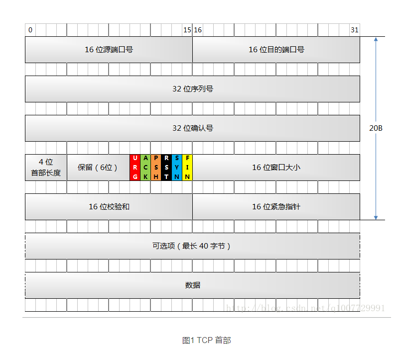
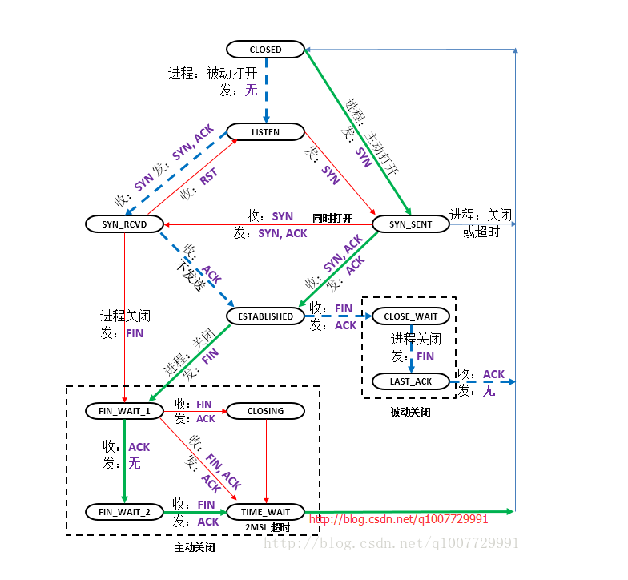
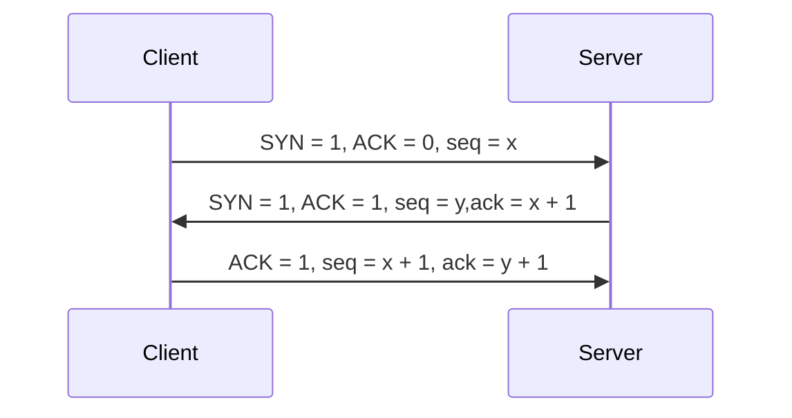
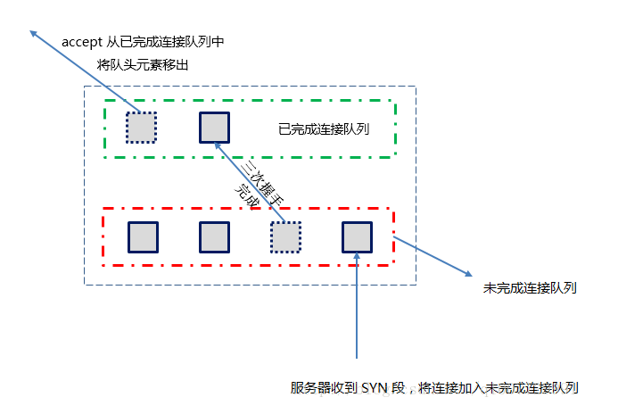
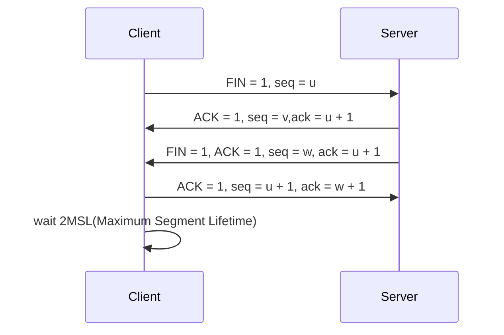

## TCP协议
特点：
1. 面向连接的传输层协议
2. TCP是点对点的协议
3. TCP提供可靠的交付服务，保证传输的数据无差错、不对事、不重复且有序
4. TCP提供全双工通信
5. TCP是面向字节流的

### TCP报文段
报文段由TCP首部和TCP数据两部分组成
TCP报文首部最短为20字节，最大长度为60字节。
#### 一些重要的字段
1. 序列字段(seq)：序号字段的值为为本报文段所发送的数据的第一个字节的序号
2. 确认号字段(ack)：值为期望收到对方的下一个报文段的数据的第一个字节的序号。若确认号为N，则表示N-1为止的所有数据都正确收到
3. 确认位(ACK)：只有当ACK=1时确认字段才有效
4. 同步位(SYN)：SYN=1表示这是一个连接请求报文或者连接接收报文
5. 推送位(PSH)：当接收到PSH=1时，尽快交付接收应用进程，而不是缓存填满后再交付
6. 终止位(FIN)：用来释放连接，FIN=1表名此报文段的发送方的数据已发送完毕，并要求释放传输连接
7. 检验和：和UDP一样，需要加上12字节的伪首部。协议字段为6，其他和UDP一样

### 首部

#### 序列号
存在的意义：接收方接收到多个TCP报文段的时候，不清楚它们之前的顺序，**因此需要序列号来保证它们之间的顺序**。
必须包含以下两个条件之一，序列号才有意义：
- 数据字段至少包含一个字节
- 这是一个 SYN 段，或者是 FIN 段，或者是 RST 段。

#### 确认号
意义：接收方通过回复一个确认号，来**表示确认已经接收到了哪个TCP段**。在 TCP 协议中，一般采用**累积确认**的方式，即每传送多个连续 TCP 段，可以只对最后一个 TCP 段进行确认。**只有当ACK标志位被置位的时候，确认号这个字段才有效**。

#### PSH标志位
发送方使用该标志通知接收方将所收到的数据全部提交给接收进程
#### URG标志位和紧急指针
利用URG配合紧急指针，就可以找到紧急数据的字节号
> 紧急数据字节号(urgSeq) = TCP 报文序号(seq) + 紧急指针(urgpoint) - 1
注意：
- 即使是紧急数据，仍然会随着普通数据流一起发送，并不会单独为紧急数据开辟一条新的连接通道单独发送。紧急数据不会被优先发送出去
- 如果发送方多次发送紧急数据，最后一个数据的紧急指针会将前面的覆盖

### TCP连接
TPC连接需要解决的问题
1. 要每一方都能够确认对方的存在，检测双方的发送和接受数据能力正常
2. 要允许双方协商一些参数(如窗口最大值、时间戳、序列号等)
   1. 确定初始化序列号(ISN),保证接受方知道哪一个报文是第一个报文
3. 能够对运输实体资源进行分配
TCP连接的端口是套接字
TCP采用C/S模式

#### TCP 状态机

#### TCP的三次握手

通俗来讲：
client 对 server 说：我要建立连接
server 对 client 说：我已经准好了建立连接了，你也准备一下
client 对 server 说：我也准备好了，可以开始了传输数据了

#### TCP 三次握手队列（未完成连接队列，已完成连接队列）
- **未完成连接队列**（incomplete connection queue），服务器只要收到了 SYN 段，就将该连接加入未完成连接队列。
- **已完成连接队列**（complete connection queue），服务器收到了客户端对 SYN 段的确认，将未完成连接队列中的连接移到已完成连接队列。

#### TCP的四次挥手

通俗来讲：
client 对 server 说：我传完数据了，我要关闭链接了
server 对 client 说：等一下，我还有数据传给你
server 传完在对 client 说：我也传完数据了，可以关闭链接了
client 对 server 说：好的，我收到。
client 等了一会再关，为了防止还有消息在路上。如果有通知过来，我就再等会。

#### 为什么需要四次挥手
因为TCP连接是全双工的。因此每个方向就必须能够单独的关闭。就比如客户端执行了半关闭操作后，只是通知服务器它没有数据要发送了，并不代表它不能接收数据。因此，只要服务器还没有主动关闭，就能够向客户端继续发送数据。也就相当于在步骤 2 和 步骤 3 之间，服务器仍然能够向客户端发送数据。

#### 为什么要等待2MSL
MSL表示报文的最大存活时间，等待2MSL能够
- 防止连接终止的最后一个ACK丢失
- 2MSL足以让报文在网络中消失。防止上一次连接传输的数据影响新的TCP连接。在2MSL中，端口处于TIME_WAIT状态，是无法建立新的连接的。这样就保证了每成功建立一个新连接时，旧连接中的重复 TCP 段都已消逝

#### 一直处于FIN_WAIT2的状态如何解决
当主动关闭一方进入FIN_WAIT2 状态时，**只要对端还没有发送 FIN 段过来**（处于 CLOSE_WAIT 状态，等等再关闭，我还有数据要发送），就会一直停留在这个状态。为了防止这种无限 FIN_WAIT2，设置了一个定时器。如果这个连接空闲10分钟75秒，TCP 将进入 CLOSED 状态

**四次挥手为被动关闭的一方提供了很大的伸缩空间，让被动关闭一方有机会继续向主动关闭一方发数据**，如果TCP 协议标准要求步骤 2 和 步骤 3 合并成一个步骤，这种伸缩空间就没有了，也就是说只要有一端关闭了，另一方就没有机会继续发送数据。

### 提供网络利用率
#### Nagle 算法
- 一个 TCP 连接上最多只能有一个未被确认的未完成的小分组，在它到达目的地前，不能发送其它分组。
- 在上一个小分组未到达目的地前，即还未收到它的 ack 前，TCP 会收集后来的小分组。当上一个小分组的 ack 收到后，TCP 就将收集的小分组合并成一个大分组发送出去。

#### 累计确认
有时候，发送方发送速度非常快，接收方一下下接收到了好几个 tcp 段，可以通过累积确认的方式，一次确认好几个 tcp 段，这样减少报文段的传输。
#### 捎带确认
，双方互相发送数据，当接收到对方的 tcp 段后，先不着急确认，而是等待一会儿，连同数据和 ack 一起发送过去，这种情况叫捎带确认。如果等了一会儿（到时间了），接收方还没有数据要发送，那就直接回复一个纯 ack 过去，这样的 ack 称为延时的 ack（Delayed ACK）.

### 异常处理
#### 连接异常
当请求连接的主机不在网络中或者主机在网络中，但是服务没有开启时候，客户端会尝试重新发3此SYN报文尝试重新连接

#### 异常释放连接
正常情况下，**关闭连接的方式是发送FIN段**，即四次挥手。这种方式也称为有序释放(orderly release)。也可以**通过发送RST段给对端来释放连接，这种方式称为异常释放**(abortive release)。

异常终止连接特点：
- 丢弃任何尚未发送的数据，立即发送RST报文段
- RST 接收方会区分另一端是异常关闭还是正常关闭，从而做出不同响应
- 任何收到 RST 段的一方根本不会为这个RST进行确认
- 主动发送 RST 段的一方，不会进入TIME_WAIT状态。

#### 半打开
当一方已经关闭或异常终止连接，而另外一方却不知情。这种就称之为TCP半打开。
比如客户端主机突然断电。
- 如果客户端之后仍然接上网络，但是未开启服务。服务器端发送数据，经过数次重传后放弃连接，并发送RST段。
- 如果客户端连上了网络并开启了服务，服务器向客户端发送数据，因为客户端不认识这个连接，因此向服务器端发送RST段。

#### 同时打开/关闭
同时打开关闭，指的是已建立连接的两端同时发起主动打开/关闭。
对于同时打开，TCP只建立一条连接而不是两条连接。
对于同时关闭，双方接收到了FIN之后，端口会变成close状态，但是收到ACK时，状态就变化为TIME_WAIT

### 窗口糊涂症
糊涂窗口综合症。原文叫 Silly Window Syndrome，简称 SWS.
SWS 是这样一种情况：接收方通告了一个 1 字节的窗口给发送方，然后发送方发送了 1 字节的数据给接收方。接着，接收方又通告了一个 1 字节的窗口，这样持续下去，使网络的效率很低。
解决措施：
- 针对接收方来说，先等一段时间，等到接收缓存有足够的空间了才发出确认。
- 针对发送方来说，发送方不要发送太小的报文，而是把数据积累成一个足够大的报文段（达到 MSS），或者是积累到接收方通告窗口大小一半的报文段