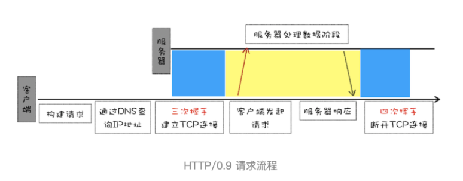
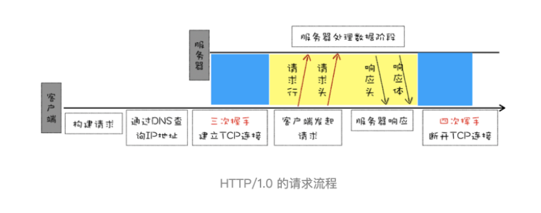
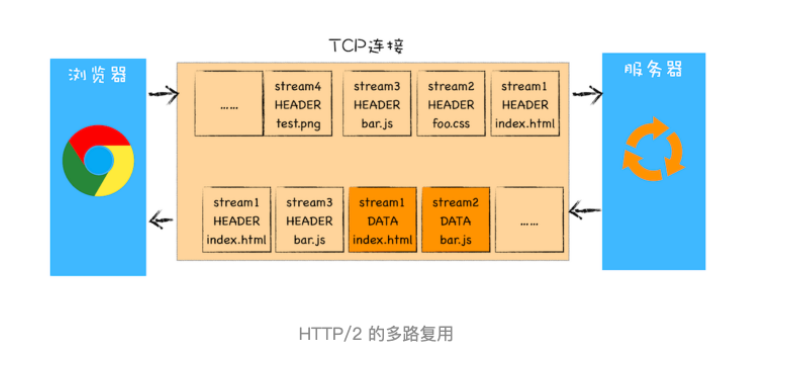
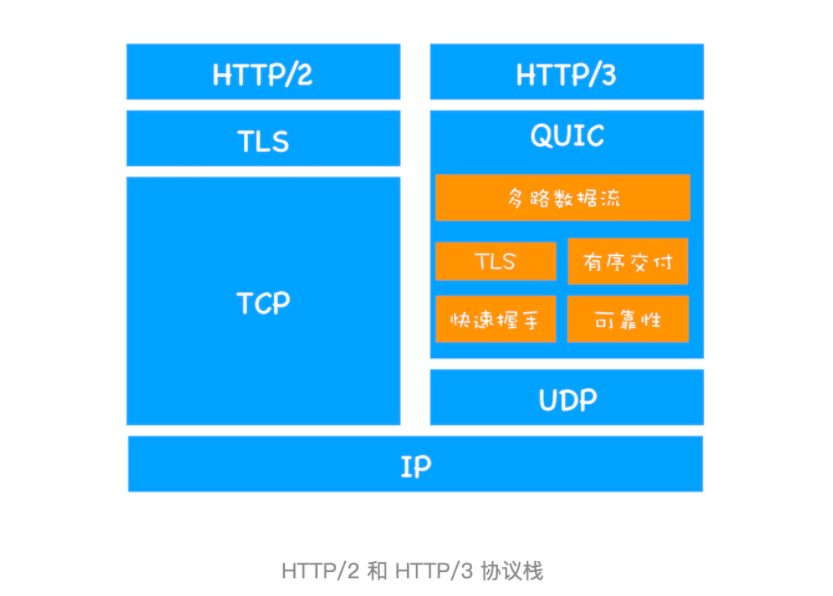

# HTTP协议
使用端口号 80
特点
1. 无状态
2. 采用TCP
3. 既可以使用持久连接也可以使用非持久连接

### HTTP 0.9
#### 请求流程

#### 特点
1. 只有一个请求行，没有HTTP请求头和请求体
2. 服务器没有返回头信息，只返回数据
3. 使用ASCII字符来传输

### HTTP 1.0
#### 请求流程

#### 改进
添加请求头和响应头进行协商，解决
- 服务器返回的数据是什么类型
- 采取什么样的形式压缩
- 提供什么语言文件
- 文件的具体编码类型

### HTTP 1.1
#### 改进
##### 加入持久连接
- 解决的问题：HTTP/1.0 每进行一个HTTP通信，都要经历TCP连接，传输数据，断开TCP的步骤。
- 方案：加入持久连接使得在一个TCP上可以传输多个HTTP请求。
##### 加入HTTP 管线化(不成熟)
- 解决的问题：持久连接虽然能减少TCP的建立和断开次数。但是下一个请求要等待前面一个请求返回之后，若前面请求没有及时返回，会阻塞后面的请求
- 方案：加入管线化，将多个HTTP请求整批提交给服务器。虽然可以整批发送，不过还需要根据请求来回复浏览器的请求
##### 提供虚拟主机支持
- 解决的问题：一个物理主机上绑定了多个虚拟主机，每个虚拟主机都有单独的域名，但是都是同一个IP
- 方案：在请求头添加Host字段，表示当前域名的地址。这样服务器就可以根据不同的host来做不同的处理
##### 对动态生成的内容进行支持
- 解决的问题：在传输数据之前并不知道最终的数据大小，导致浏览器不知道何时会接受完所有的数据文件
- 方案：引入Chunk transfer机制，服务器将数据分割成若干任意大小的数据块，每次发送时会附上上个数据块的长度，最后一个使用零长度的块作为发送数据完成的标志
##### 客户端Cookie，安全机制

### HTTP 2
#### HTTP 1.1 的问题
1. TCP启动慢，TCP本身是慢启动的
2. 同时开启多条TCP连接，连接会竞争固定的宽带
3. HTTP/1.1队头阻塞问题
#### 改进
##### HTTP/2 多路复用

- 解决的问题：TCP慢启动，多TCP连接竞争的问题
- 方案：一个域名只使用一个TCP长连接来传输数据，页面资源下载过程只需要慢启动一次，也避免了多TCP连接竞争的问题
##### HTTP/2 多路复用实现
引入二进制分帧层
1. 浏览器准备好了请求数据，包括请求行、请求头等信息
2. 这些数据经过二进制分帧层处理后，会转化为一个个带ID的帧,通过协议将这么帧发送给服务器
3. 服务器接收到所有帧以后，会将相同ID的帧合并为一条完整的请求信息
4. 服务器处理后，将处理的响应行、响应头和响应体分别发送到二进制分帧层
5. 二进制分帧层会将响应数据一个个转化为带ID的帧，发送给浏览器
6. 浏览器接收到响应帧后，会根据ID编码将帧的数据提交给对应的请求

##### 可设置请求的优先级
##### 服务器推送
##### 头部压缩

### HTTP 3
#### TCP的问题
1. TCP队头阻塞
2. TCP建立的时延
3. TCP协议中间设备的僵化

#### QUIC协议
- QUIC实现了类似TCP的流量控制，其在UDP的基础上增加了一层来保证数据可靠性传输，包括数据包重传，拥塞控制和一些TCP的存在的特性
- 集成了TLS加密功能
- 实现了HTTP/2的多路复用功能。和TCP不同,QUIC实现了在同一个物理连接上可以有多个独立的逻辑数据流，实现了数据流的单独传输，解决了TCP的队头阻塞问题
#### 协议栈

