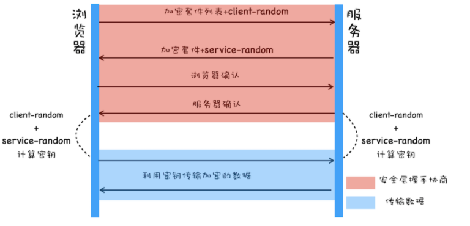
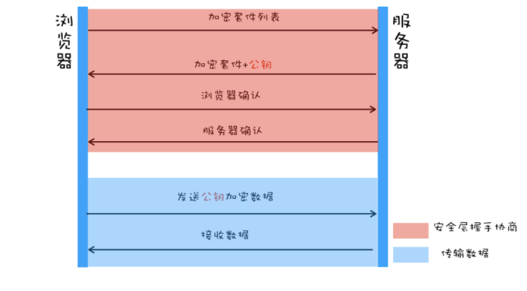
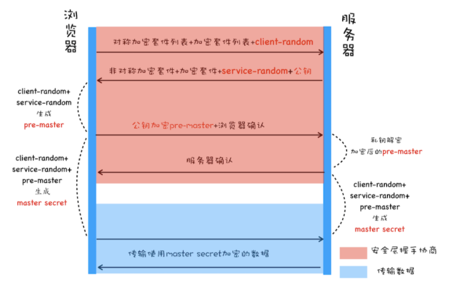

# HTTPS 
## 在HTTP协议栈中引入安全层
- 目的：解决HTTP明文传输的问题，避免中间人攻击
- 安全层的职责
  1. 对发起HTTP请求的数据进行加密操作
  2. 对接受到的HTTP的内容进行解密

## 使用对称加密协议

### 流程
1. 浏览器发送加密套件列表(加密方法)和一个随机数(client-random)给到服务器
2. 服务器收到后，选择加密套件并产生一个随机数(service-random)返回给浏览器
3. 浏览器和服务器使用两个随机数并用加密套件计算密钥
4. 之后传输利用密钥加密的数据
### 缺陷
- 传输随机数的时候是明文的，而且合成密钥的算法是公开的。因此黑客拿到随机数后也可以进行破解

## 使用非对称加密协议

### 流程
1. 浏览器会发送加密套件列表给到服务器
2. 服务器发送加密套件和公钥给到浏览器，私钥由服务器自己保存
3. 浏览器和服务器互相确认，确认之后，浏览器利用公钥加密发送数据
### 缺陷
1. 非对称加密效率太低
2. 无法保证服务器发送给浏览器的数据安全。由于私钥加密只有公钥可以解密，黑客也能获取到公钥，不能保证服务器的安全
   
## 对称加密和非对称加密混合使用

### 流程
1. 浏览器发送对称加密套件列表和加密套件列表和Client-random给到服务器
2. 服务器返回对称加密和非对称加密套件，service-random 和 公钥给到浏览器
3. 浏览器根据client-random和service-random计算pre-master，然后利用公钥对pre-master进行加密，发送给加密后的数据给服务器
4. 服务器解密加密后的pre-master返回服务器确认给浏览器
5. 浏览器和服务器根据client-random和service-random和pre-master生成master secret
6. 之后传输利用master secret加密的数据
### 特点
1. pre-master 是经过公钥加密后传输的，所以黑客无法获取到pre-master，因此他们就无法生成密钥
2. 使用3个随机数，能够降低被暴力破解的可能性
### 缺点
1. 黑客能通过DNS劫持将IP变成黑客的IP，这样访问的就变成了黑客的服务器

## 添加数据证书
### 数据证书的作用
- 通过数字证书向浏览器证明服务器的身份
- 数字证书里面包含了服务器的公钥
### 流程
1. 相比于使用对称加密和非对称加密混合使用，服务器不返回公钥给浏览器，而是直接返回数字证书给浏览器，因为数字证书里面包含了公钥
2. 浏览器在生成pre-master之前，需要验证一下数据证书。这样黑客即使伪造了服务器，也无法伪造证书

### 浏览器如何验证数字证书
1. 浏览器接收到数字证书后，会读取证书中的明文信息，采用CA签名相同的hash函数来计算并得到信息摘要A
2. 采用对应的CA的公钥解密签名数据，得到信息摘要B
3. 对比信息摘要A和B，相同则表示是合法的