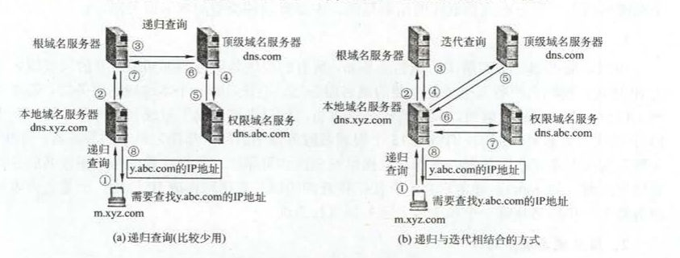
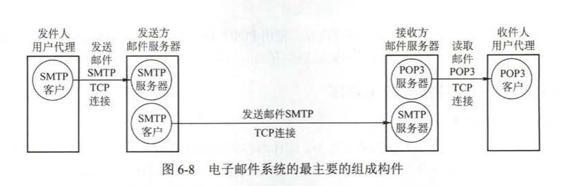

### DNS
作用：将域名解析成IP地址
DNS使用C/S模型，运行在UDP上，使用53号端口
域名解析原理
常使用迭代查询和递归查询

### FTP
FTP提供交互式访问，允许客户指明文件的类型和格式，并且允许文件具有存取的权限。
使用C/S模型
功能：
1. 提供不同种类主机系统之间的文件传输能力
2. 以用户权限管理的方式提供用户对远程FTP服务器上的文件管理能力
3. 以匿名FTP的方式提供公用文件共享的能力

FTP在工作时使用两个并行的TCP连接，一个是控制连接(端口号21)，一个数据连接。

#### FTP传输模式
FTP的传输模式分为主动传输和被动传输。
- 主动传输是当建立好控制连接之后，客户端向服务器发送PORT命令(包含客户端使用什么端口接受数据)，然后服务器就使用端口号为20的端口与客户端指定的端口建立数据连接。
- 被动传输是当建立好控制连接之后，客户端向服务器端发送PASV命令。服务器接受到PASV命令之后随机 打开一个高端端口，并通知客户在这个端口上传输数据，客户端收到该端口再建立数据连接。

数据连接的端口号使用20与FTP的传输模式有关，如果采用主动模式，则数据传输端口号为20，若采用被动模式，则由服务器端和客户端协商决定。

### 电子邮件
电子邮件的三大组件：用户代理，邮件服务器和电子邮件使用的协议

SMTP协议使用的是“推的方式”。而POP3使用的是拉的方式
#### SMTP协议
简单邮件传输协议(Simple Mail Transfer Protocol)。使用的是C/S方式。在传输层使用TCP协议，端口号为25。只能传输一定长度的ASCII码
SMTP通信的三个阶段：
1. 建立连接
2. 邮件传送
3. 连接释放
#### POP3协议
邮局协议(Post Office Protocol)。使用的是C/S方式。在传输层使用TCP协议。端口号为110
另外一个邮件接受协议是网际报文存取协议IMAP。
