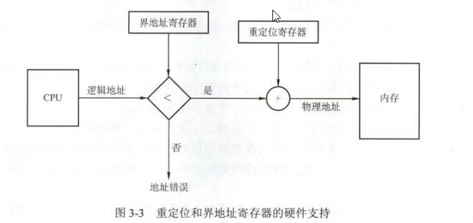
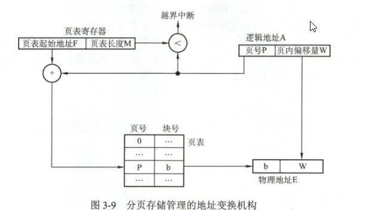
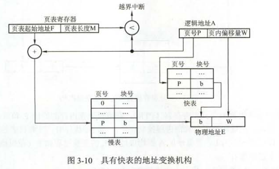
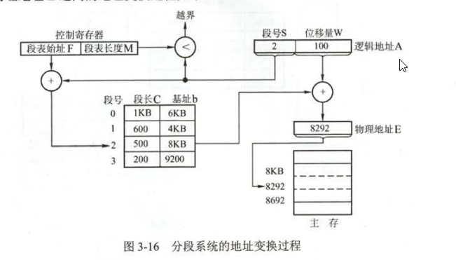

[TOC]
## 内存管理
功能
- 内存空间的分配和回收
- 地址转换
- 内存空间的扩充
- 存储保护
### 用户源程序变为内存中的执行程序的步骤
1. 编译
2. 链接
   1. 静态链接
   2. 装入时动态链接
   3. 运行时动态链接
3. 装入
   1. 绝对装入
   2. 可重定位装入
   3. 动态运行时装入

### 内存保护
内存分配前，需要保护操作系统不受用户进程的影响，同时保护用户进程不受其他用户进程的影响
1. 在CPU设置一对上下限寄存器，存放用户作业主存的上下限
2. 采用重定位寄存器(基址寄存器)和界地址寄存器(限长寄存器)来实现。冲顶文寄存器含最小的物理地址值，界地址寄存器含逻辑地址的最大值

### 扩充内存的方法
1. 覆盖
   用于同一进程或程序中的
2. 交换
   作用在不同进程之间的

### 内存的分配方式
#### 连续分配管理方式
1. 单一连续分配
   有内部碎片
2. 固定分区分配
   有内部碎片
3. 动态分区分配
   通过紧凑来解决外部碎片，没有内部碎片
   算法：
   1. 首次适应。找第一个满足要求的分区
   2. 最佳适应。按容量递增，找第一个满足要求的分区
   3. 最坏适应。找满足要求的最大分区
   4. 邻近适应。从上次查找的位置开始找第一个满足要求的分区

#### 非连续分配管理方式
##### 基本分页存储管理方式
1. 基本地址变换机构
   借助页表实现(实质上是页号地址转化为块号地址)
   
   存在问题：
   1. 地址转换必须足够快，否则访存速度会降低
   2. 页变不能太大，否则内存利用率回降低
2. 具有快表的地址变换机构
   
3. 两级页表
##### 基本分段存储管理方式
1. 基本分段地址变换机构(实质上通过基址和偏移量寻找物理地址)
   
2. 段页式管理方式 