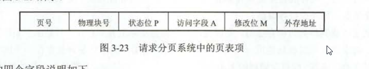

## 虚拟内存
内存管理策略的缺陷
1. 作业必须一次性全部装入内存
2. 作业被装入内存后，一直驻留在内存中。

虚拟内存的大小决定因素
1. 虚拟内存的大小小于内存容量和外存容量之和
2. 虚拟内存的大小小于计算机的地址位数能容纳的最大容量

### 虚拟内存的实现
原理：采用连续分配方式时，会使部分内存空间处于暂时或者“永久”的空闲状态，造成内存资源的浪费，也无法重逻辑上扩大内存容量。因此虚拟内存建立在离散分配的内存管理方式上
实现方式：
1. 请求分页存储管理
2. 请求分段存储管理
3. 请求段页式存储管理

### 页表机制
不同于基本分页系统的页表。请求分页系统在一个作业运行前不要求全部一次性调入内存。必然会出现访问的页面不在内存的情况。因此在请求页表项中添加了四个字段

新增的字段为
- 状态位P：指示该页是否调入内存
- 访问字段A：记录本页在一段时间内被访问的次数
- 修改位M：标识该页在调入内存后是否有被修改过
- 外存地址：指出该页的外存上的地址

### 换页的置换算法
1. 最佳置换算法(OPT)
2. 先进先出算法(FIFO)
3. 最近最久未使用算法(LRU)
4. 时钟置换算法(CLOCK)，也叫最近未用算法(NRU)
   - 简单CLOCK算法，添加一个使用位
   - 改进的CLOCK算法
    每一帧的情况有四种
      - 最近未被访问，也未被修改
      - 最近未被访问，但被修改
      - 最近被访问，但未被修改
      - 最近被访问，被修改
    置换的优先级越来越低

### 页面分配策略
1. 驻留集大小
   - 固定分配局部置换
   - 可变分配全局置换
   - 可变分配局部置换
2. 调入页面时机
   - 预调页策略
   - 请求调页策略
3. 从何处调页页面
   外存分为两个部分：采用连续分配方式的对换区，采用离散分配方式的文件区
   - 系统拥有足够的对换区空间
   - 系统缺少足够的对换区空间
