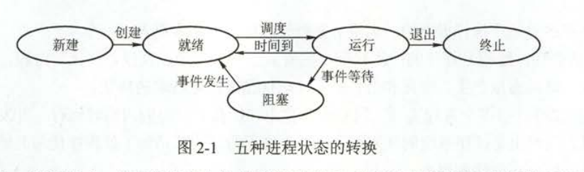

## 进程
主要部分
- 程序段：进程完成的功能。类似于工人
- 数据：程序在执行时所需要的数据。类似于原材料
- PCB：包含进程的描述信息和控制信息。是进程存在的唯一标志。类似于管理员
- 进程是系统进行资源分配和调度的一个独立单位。这里的系统资源是指处理机、存储器和其他设备服务于进程的“时间”。
进程是一个动态的、过程性的概念

特征：
1. 动态性
2. 并发性
3. 独立性
4. 异步性

进程的状态
1. 运行态
2. 就绪态
3. 阻塞态
4. 创建态
5. 结束态

进程状态之间的转换

### 进程的控制
父进程与子进程
- 子进程被撤销时，资源归还给父进程
- 父进程被撤销时，必须同时撤销所有子进程
#### 进程的创建
PCB是进程实体的一部分，是进程唯一存在的唯一个标志。
过程
1. 为新进程分配一个唯一的进程标识号(PID)，并申请空白的PCB
2. 为进程分配资源，分配程序和数据以及用户栈分配必要的内存空间
3. 初始化PCB，包括初始化标志信息、处理机状态信息和控制信息。设置进程优先级
4. 如果就绪队列能接纳新进程，就插入到就绪队列中

#### 进程的终止
1. 根据终止进程的标识号，检索PCB，读出改进程的状态
2. 若进程处理执行状态，立即终止该进程的执行，将处理机分配给其他进程
3. 若还有子进程，则应该将所有子进程终止
4. 将所有资源归还给父进程或者是操作系统
5. 将PCB从所在队列里删除

#### 阻塞
1. 找到被阻塞进程的标记号对应的PCV
2. 若进程处于运行状态，则保留现场，将其转态转为阻塞状态。
3. 将PCB插入响应时间的等待等待队列中

#### 唤醒
1. 在等待队列中找到相应进程的PCB
2. 将其在等待队列一出去，并置为就绪状态
3. 将该PCB插入就绪序列中。
#### 进程的切换
1. 保存现场
2. 更新PCB信息
3. 将PCB移入相应队列
4. 选择另外一个进程，更新PCB
5. 更新内存管理的数据结构
6. 恢复现场

### 进程通信
方式
1. 共享存储
2. 消息传递
   1. 直接通信
   2. 间接通信
3. 管道通信
   半双工机制
   管道通信必须提供的能力： 互斥、同步和确定对方的存在

