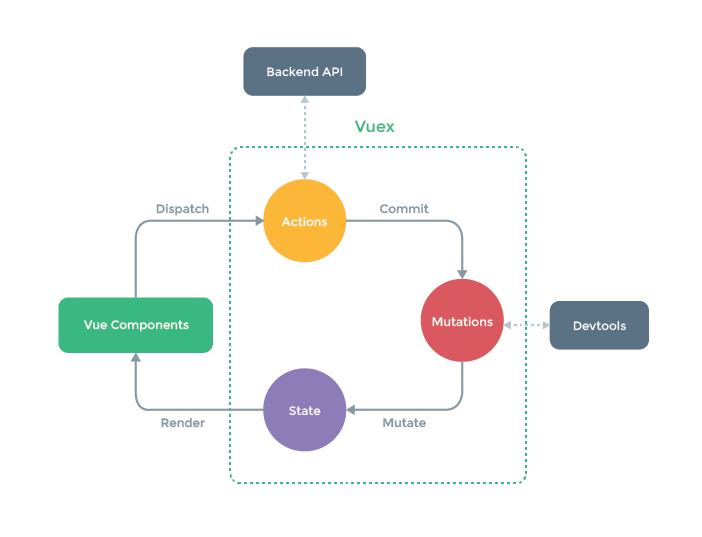

# Vuex
## Vuex的本质
Vue的插件
核心就是一个Store对象，他是一个全局并且是单例的对象
这个对象通过state保存数据，里面getter和mutation和action的操作方式

## 核心概念
### State
State就是状态数据，而Actions、Mutations都是对这些状态数据进行处理
### Getters
getter 的返回值会根据它的依赖被缓存起来，且只有当它的依赖值发生了改变才会被重新计算
### Mutations
Mutation是更改state的唯一方法。Mutation唯一的触发方式就是commit，mutation非常类似于事件注册，mutation必须是同步函数
### Actions
用法和Mutations一样，但是可以是异步函数，action处理函数所做的事情则是commit mutation
### Modules
module 实际上就是对Store对象的切割。可以理解为对Store进行水平切分和垂直切分独立的模块。每个模块可以看做为一个命名空间。而最外层的Store则是全局命名空间。

## Vuex的状态管理

View

1. Vue组件通过dispatch的方法调用Actions
2. 在Actions中，使用commit的方法调用mutations
3. mutations更改了state之后重新渲染到Vue组件

## 辅助函数
本质是一个快捷映射，作用是简化开发

### 为什么Mutation必须为同步
Mutation唯一的限制就是同步Mutation,作用的为了能用devtools追踪变化

https://mobilesite.github.io/2016/12/18/vuex-introduction/