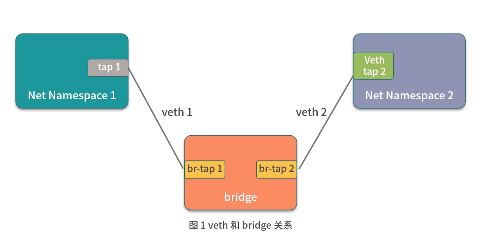
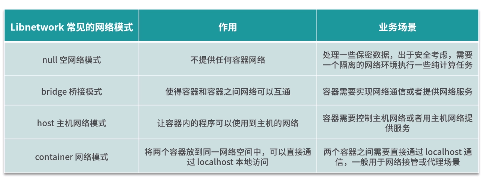

# Docker 网络
## CNM(Container Network Model)
CNM (Container Network Model) 是 Docker 发布的容器网络标准，意在规范和指定容器网络发展标准，CNM 抽象了容器的网络接口 ，使得只要满足 CNM 接口的网络方案都可以接入到 Docker 容器网络，更好地满足了用户网络模型多样化的需求
网络标准的三个元素
1. 沙箱（Sandbox）：沙箱代表了一系列网络堆栈的配置，其中包含路由信息、网络接口等网络资源的管理
2. 接入点（Endpoint）：接入点将沙箱连接到网络中，代表容器的网络接口
3. 网络（Network）：网络是一组可以互相通信的接入点，它将多接入点组成一个子网，并且多个接入点之间可以相互通信

为了更好地构建容器网络标准，Docker 团队把网络功能从 Docker 中剥离出来，成为独立的项目 libnetwork，它通过插件的形式为 Docker 提供网络功能。使用 Golang 编写，它完全遵循 CNM 网络规范，是 CNM 的官方实现

## Libnetwork
Libnetwork 比较典型的网络模式主要有四种
### 1. null 空网络模式
构建一个没有网络接入的容器环境，以保障数据安全
### 2. bridge 桥接模式
可以打通容器与容器间网络通信的需求。bridge 桥接模式是 Docker 的默认网络模式。桥接模式是基于Linux的veth和bridge技术实现的
#### Linux veth
veth 是 Linux 中的虚拟设备接口，veth 都是成对出现的，它在容器中，通常充当一个桥梁。veth 可以用来连接虚拟网络设备，例如 veth 可以用来连通两个 Net Namespace，从而使得两个 Net Namespace 之间可以互相访问
#### Linux bridge
Linux bridge 是一个虚拟设备，是用来连接网络的设备，相当于物理网络环境中的交换机。Linux bridge 可以用来转发两个 Net Namespace 内的流量
#### veth和bridge的关系

bridge 就像一台交换机，而 veth 就像一根网线，通过交换机和网线可以把两个不同 Net Namespace 的容器连通，使得它们可以互相通信
### 3. host 主机网络模式
可以让容器内的进程共享主机网络，从而监听或修改主机网络
使用 host 主机网络模式时
- libnetwork 不会为容器创建新的网络配置和 Net Namespace
- Docker 容器中的进程直接共享主机的网络配置，可以直接使用主机的网络信息，此时，在容器内监听的端口，也将直接占用到主机的端口
- 除了网络共享主机的网络外，其他的包括进程、文件系统、主机名等都是与主机隔离的
### 4. container 网络模式：可以将两个容器放在同一个网络命名空间内，让两个业务通过 localhost 即可实现访问
container 网络模式允许一个容器共享另一个容器的网络命名空间
### 网络模式和应用场景
