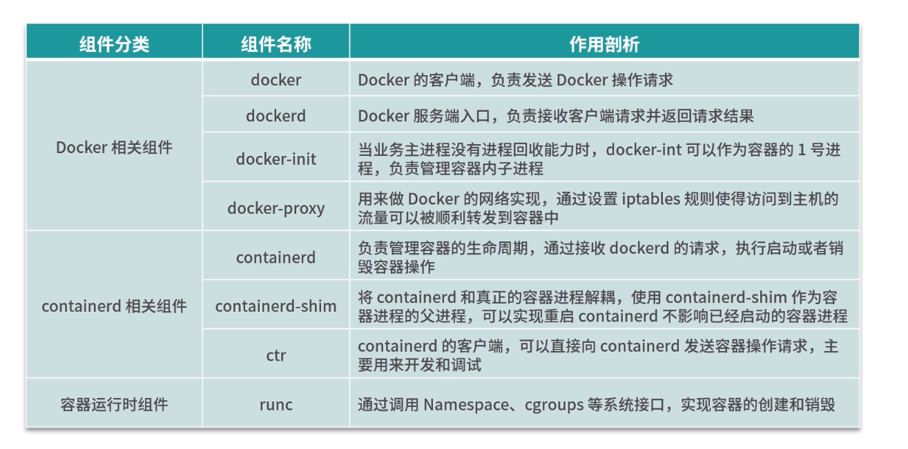

# Docker 组件
*Docker 在linux下默认的安装目录/var/lib/docker*
## Docker 相关组件
### docker 客户端
对用户可见的操作形式为 docker 命令，通过 docker 命令可以完成所有的 Docker 客户端与服务端的通信（还可以通过 REST API、SDK 等多种形式与 Docker 服务端通信）
客户端与服务器端交互的过程：
    docker 客户端向服务端发送请求后，服务端根据请求执行具体的动作并将结果返回给 docker客户端，docker 解析服务端的返回结果，并将结果通过命令行标准输出展示给用户。这样一次完整的客户端服务端请求就完成了
### dockerd
dockerd 是 Docker 服务端的后台常驻进程，用来接收客户端发送的请求，执行具体的处理任务，处理完成后将结果返回给客户端
Docker 客户端与 dockerd 的交互方式有三种，客户端和服务器端的通信必须保持一致
1. 通过 UNIX 套接字与服务端通信
   配置格式为unix://socket_path，默认 dockerd 生成的 socket 文件路径为 /var/run/docker.sock。该文件只有root用户和docker用户组的用户才能访问
2. 通过 TCP 与服务端通信
   配置格式为tcp://host:port，存在安全隐患，可以使用TLS认证来保证传输安全
3. 通过文件描述符的方式与服务端通信
    配置格式为：fd://这种格式一般用于 systemd 管理的系统中
### docker-init
在容器内部，当我们自己的业务进程没有回收子进程的能力时，在执行 docker run 启动容器时可以添加 --init 参数，此时 Docker 会使用 docker-init 作为1号进程，帮你管理容器内子进程，例如回收僵尸进程等
### docker-proxy
docker-proxy 主要是用来做端口映射的，底层依赖于iptables实现
## containerd相关组件
### containerd
#### 功能
1. 负责容器生命周期的管理
2. 镜像的管理，例如容器运行前从镜像仓库拉取镜像到本地
3. 接收 dockerd 的请求，通过适当的参数调用 runc 启动容器
4. 管理存储相关资源
5. 管理网络相关资源
#### containerd和dockerd的交互
containerd 包含一个后台常驻进程，默认的 socket 路径为 /run/containerd/containerd.sock，dockerd 通过 UNIX 套接字向 containerd 发送请求，containerd 接收到请求后负责执行相关的动作并把执行结果返回给 dockerd。
### containerd-shim
containerd-shim 的主要作用是将 containerd 和真正的容器进程解耦，使用 containerd-shim 作为容器进程的父进程，从而实现重启 containerd 不影响已经启动的容器进程
### ctr
containerd的客户端，可以直接向containerd发送容器请求
## runc（容器运行时组件）
runc 是一个标准的 OCI 容器运行时的实现，它是一个命令行工具，可以直接用来创建和运行容器

