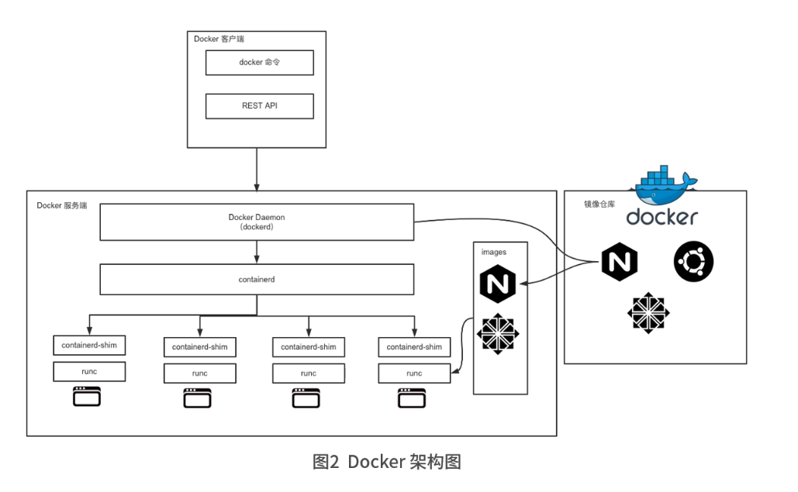
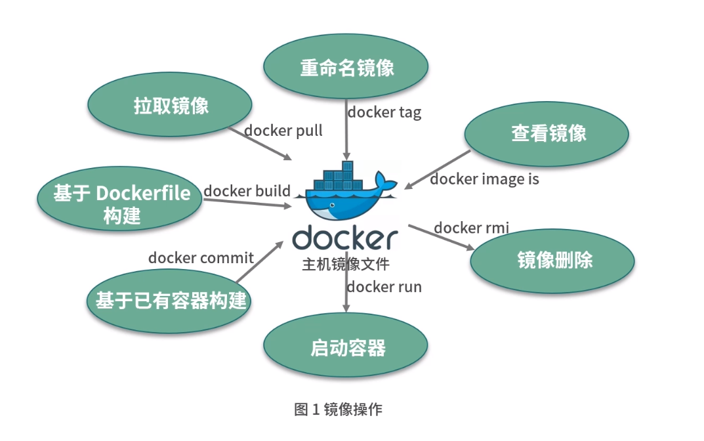
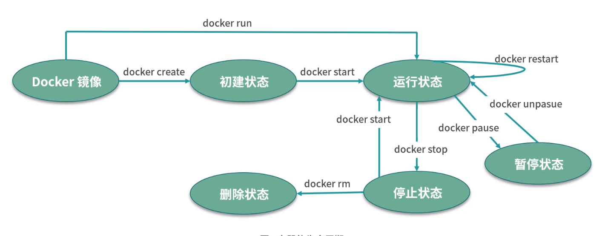
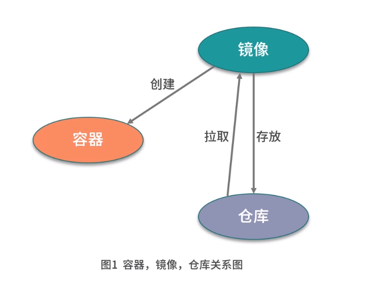

### Docker优点
- 提供一个简单、轻量的建模方式
所需要的环境知识一台仅仅安装兼容版本的linux内核和二进制文件最小限的宿主机
- 职责的逻辑分离
开发人员只需要关注容器运行的应用程序，运维只需要关注如何管理容器
- 快速、高效的生命开发周期
缩短代码从开发、测试到部署、上线运行的周期，让程序具有可以移植性，易于构建和协作
- 鼓励使用面向服务的架构
Docker推荐单个容器只运行一个应用程序或进程，形成分布式的应用程序模型。

### Docker架构

#### Docker组件
核心组件：
- Docker客户端和服务器
- Docker镜像
- Registry
- Docker容器

#### Docker客户端和服务器
Docker是一个C/S架构的程序。Docker客户端向Docker服务器或者守护进程发送请求，服务器或守护进程将完成所有工作并返回结果。

#### Docker镜像
1. 镜像是Docker生命周期中的构建部分。是基于联合(Union)文件系统的一种层式结构。他是一个只读的文件和文件夹组合。它包含了容器运行时所需要的所有基础文件和配置信息，是容器启动的基础。
2. Docker镜像的实现原理：Docker 镜像是静态的分层管理的文件组合，镜像底层的实现依赖于联合文件系统（UnionFS）。每一层的只存放了上一层的增量数据
3. 如何使用镜像：
   1. 自己创建镜像。通常情况下，一个镜像是基于一个基础镜像构建的，你可以在基础镜像上添加一些用户自定义的内容
   2. 从功能镜像仓库拉取别人制作好的镜像，如Docker Hub
4. Docker镜像的操作

#### 容器
容器是Docker生命周期中的启动部分。容器是镜像的运行实体。镜像是静态的只读文件，而容器带有运行时需要的可写文件层，并且容器中的进程属于运行状态。

容器运行着真正的应用进程。容器有初建、运行、停止、暂停和删除五种状态

使用Docker,能够快读构建一个应用程序服务器、一个消息总线、一套实用工具、一个持续集成测试环境或者任意一种应用程序、服务或工具。

容器的生命周期

#### Registry
Registry类似于代码仓库，用来存储和分发 Docker 镜像。
Registry 用于保存用户构建的镜像。分为公共和私有两种。公共Registry叫做Docker Hub。

#### 容器、仓库、镜像之间的关系

#### Docker架构

### Docker 应用场景
- 加快本地开发和构建流程
- 能够让独立服务或应用程序在不同的环境中，得到相同的运行结果
- 创建隔离的环境来进行测试
- 构建一个多用户的平台即服务基础(PaaS)设施
- 为开发、测试提供一个轻量级的独立沙河环境
- 提供软件即服务(SaaS)应用程序
- 高性能、超大规模的宿主机部署

