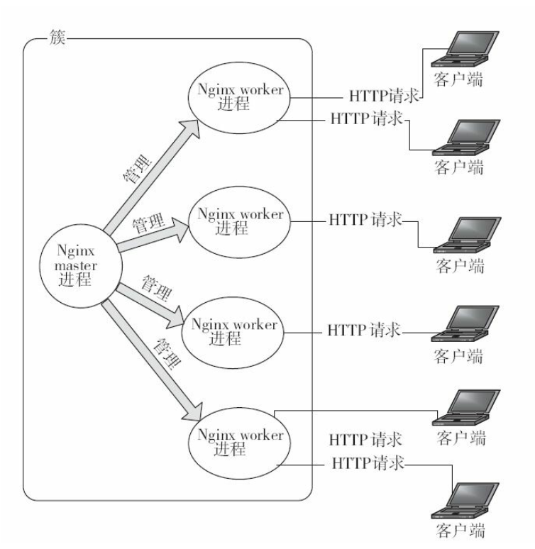

# Nginx
## 为什么使用Nginx
核心是支持高并发请求的同时保持高效的服务
- 快：Nginx可以比其他Web服务器更快地响应请求
- 高扩展：它完全是由多个不同功能、 不同层次、 不同类型且耦合度极
低的模块组成
- 高可靠：Nginx的高可靠性来自于其核心框架代码
的优秀设计、 模块设计的简单性
- 低内存：10000个非活跃的HTTP Keep-Alive连接在Nginx中仅消耗2.5MB的内存
- 单机支持10w以上的并发连接
- 热部署：master管理进程与worker工作进程的分离设计， 使得Nginx能够提供热部署功能。支持不停止服务就更新配置项、 更换日志文件等功能。

## Nginx的组成
- Nginx可以行的二进制文件
- Nginx.conf 配置文件：控制Nginx的行为
- access.log 访问日志：记录每一条http请求信息
- error.log 错误日志：定位问题

## Nginx进程间的关系
Nginx时使用一个master进程来管理多个worker进程。 一般情况下， worker进程的数量与服务器上的CPU核心数相等。 每一个worker进程都是繁忙的， 它们在真正地提供互联网服务。master进程则很“清闲”， 只负责监控管理worker
进程。**worker进程之间通过共享内存、 原子操作等一些进程间通信机制**来实现负载均衡等功能

## Nginx进程间的通讯方式
1. 信号
2. 共享内存
   1. rbtree(红黑树)会用到(限速等)
      1. ngx_stream_limit_conn_module
      2. ngx_http_limit_conn_module
      3. ngx_stream_limit_req_module
      4. http cache
      5. ssl
   2. 单链表会用到
      1. Ngx_http_upstream_zone_module
      2. ngx_stream_upstram_zone_module

引入的问题：
1. 锁
2. Slab内存管理器
### 为什么需要按照masterworker方式配置同时启动多个进程呢
1. master进程可以是唯一的， 它仅专注于自己的纯管理工作， 为管理员提供命令行服务，包括诸如启动服务、 停止服务、 重载配置文件、 平滑升级程序等。
2. 多个worker进程处理互联网请求不但可以提高服务的健壮性。可以**充分利用现在常见的SMP多核架构， 从而实现微观上真正的多核并发处理**。当Nginx上的进程数与CPU核心数相等时（最好每一个worker进程都绑定特定的CPU核心） ， 进程间切换的代价是最小的

#### 为什么建议Nginx上的进程数与CPU核心数相等时
若worker进程的数量多于CPU内核数， 那么会增大进程间切换带来的消耗（Linux是抢占式内核）。同时worker进程绑定指定的CPU内核

#### 为什么需要绑定到指定的内核
假定每一个worker进程都是非常繁忙的， 如果多个worker进程都在抢同一个CPU， 那么这就会出现同步问题。 反之， 如果每一个worker进程都独享一个CPU， 就在内核的调度策略上实现了完全的并发。

## Nginx Hash表使用的注意
1. 只为静态的，不变的内容服务
2. hash表的bucket_size 需要考虑cpu cache line 的对齐问题

## 日志分析（goaccess）
## Nginx文件缓存
文件缓存会在内存中存储以下3种信息：
- 文件句柄，文件大小和修改次数
- 已经打开过的目录结构
- 没有找到或者没有权限操作的文件信息