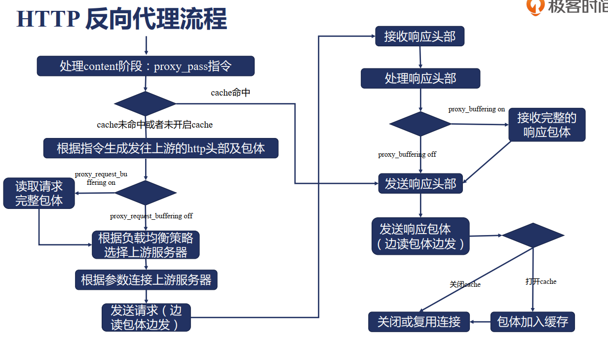

# Nginx反向代理

## 反向代理流程

## Proxy_pass模块规则
- URL必须以http://或者https://开头，接下来时域名，IP，unix socket地址或者upstream的名字。可以在域名或者IP之后加端口，最后可选的时URI
- Nginx会根据当前URL参数当中携带URI与否，会导致发至上游请求的URL不同，
  - 不携带URI时，则直接将客户端请求中的URL直接发送到上游服务器。location参数后使用正则表达式、@名字时，应采用这种方式
  - 携带URI时，会将location参数匹配上的一段替换为该URI
- 更复杂的URL替换，可以在location内配置添加rewrite break语句

## 发送给上游的http请求头部包体处理
- 请求行
  - proxy method
  - proxy_http_version 1.0|1.1
- 请求头部
  - proxy_set_header
  - proxy_pass_request_headers on|off:是否把请求头部发给上游，默认时开启的
- 请求体
  - proxy_set_body
  - proxy_pass_request_body on|off:是否把请求体发给上游，默认时开启的

## 接受客户端请求的包体
### proxy_request_buffering on|off
决定包体收完再转发还是边收边转发，默认时on
- on使用情景
    - 客户端网速较慢
    - 上游服务并发处理能力地
    - 适应高吞吐量场景

- off使用情景
    - 更及时的响应
    - 降低Nginx读写磁盘的消耗
    - 一旦发送内容，proxy_next_upstream功能失败

### 客户端包体的接收
#### 客户端包体的内存分配
- 若接收头部时已经接收完全部的包体，则不分配
- 若剩余待接收包体的长度小于client_body_buffer_size，则仅分配所需大小
- 分配client_body_buffer_size大小内存接收包体
  - 关闭包体缓存时，该内存上的内容及时发送给上游
  - 打开包体缓存，该端内存用完时，写入临时文件，释放内存
### 相关参数
- client_body_buffer_size：缓存body长度
- client_max_body_size: 最大包体长度限制
- client_body_temp_path：包体临时文件路径
- client_body_in_file_only：包体必须保存在文件中
- client_body_timeout：读取包体时超时

### 和上游服务器建立连接
- TCP keepalive
- HTTP keepalive

### 处理上游的响应头部
#### proxy_ignore_headers
作用：禁用某些响应头部改变Nginx的行为
可禁用功能的头部：
- X-Accel-Redirect: 由上游服务指定nginx内部重定向，控制请求的执行
- X-Accel-Limit-Rate：由上游设置发往客户端的速度限制
- X-Accel-Buffering：由上游控制是否缓存上游的响应
- X-Accel-Charset：由上游控制Content-Type的Charset
- 缓存相关：
  - X-Accel-Expires：设置响应在Nginx中缓存时间
  - Expires：控制Nginx缓存时间
  - Cache-Control：控制Nginx缓存时间
  - Set-cookie：响应中出现Set-Cookie则不缓存
  - Vary：响应中出现Vary：*则不缓存

## Nginx缓存
### Nginx如何解决缓存失效时上游服务器的压力
#### 合并回源请求，减轻峰值流量下的压力
使用proxy_cache_lock on|off，同一个时间，仅第一个请求发向上游，其他请求等待第一个响应返回或者超时后，使用缓存响应客户端。
可以通过proxy_cache_lock_timeout设置第一个返回响应的最大时间，到达时间后，直接向上游发送请求，
Proxy_cache_lock_age 上游请求返回响应的时间，到达该时间后再放行一个请求发送上游。

#### 减少回源请求，使用stale陈旧的缓存
