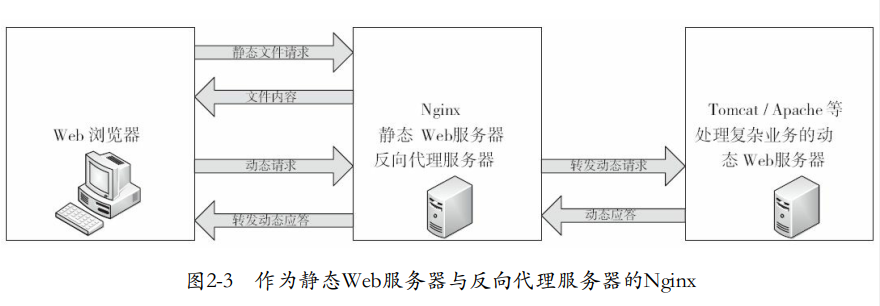
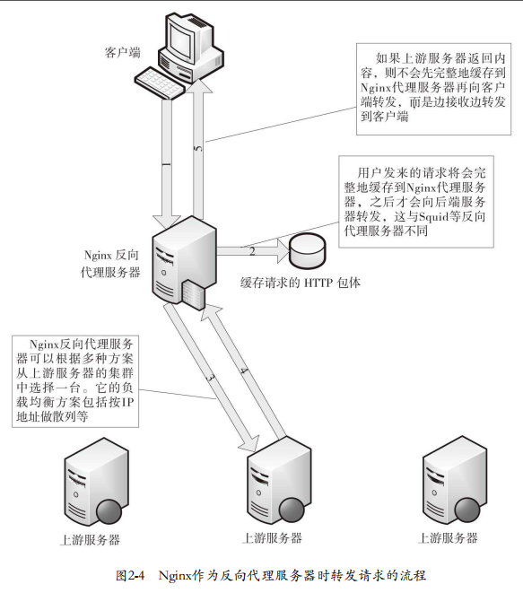

# Nginx 负载均衡
## Nginx 负载均衡特点
Nginx并不会立刻转发到上游服务器，而是先把用户的请求（包括HTTP包体） 完整地接收到Nginx所在服务器的硬盘或者内存中，然后再向上游服务器发起连接， 把缓存的客户端请求转发到上游服务器。（接收到完整的客户端请求（如1GB的文件） 后， 才会与上游服务器建立连接转发请求）。

缺点：延长了一个请求的处理时间，并增加了用于缓存请求内容的内存和磁盘空间
优点：降低了上游服务器的负载， 尽量把压力放在Nginx服务器上

## 配置
1. upstream块：upstream块定义了一个上游服务器的集群， 便于反向代理中的proxy_pass使用
2. ip_hash：我们可能会希望来自某一个用户的请求始终落到固定的一台上游服务器中。如果同一个用户的请求任意地转发到集群中的任一台上游服务器中， 那么每一台上游服务器都有可能会缓存同一份信息， 这既会造成资源。的浪费， 也会难以有效地管理缓存信息，这样确保了**同一个客户端的请求只会转发到指定的上游服务器中**。
3. proxy_pass:此配置项将当前请求反向代理到URL参数指定的服务器上， URL可以是主机名或IP地址加端口的形式。
4. proxy_method:配置项表示转发时的协议方法名
5. proxy_hide_header:Nginx会将上游服务器的响应转发给客户端， 可以任意地指定哪些HTTP头部字段不能被转发。
6. proxy_pass_header:与proxy_hide_header 相反
7. proxy_pass_request_headers：作用为确定是否转发HTTP头部。
8. proxy_redirect：当上游服务器返回的响应是重定向或刷新请求（ 如HTTP响应码是301或者302） 时，proxy_redirect可以重设HTTP头部的location或refresh字段
9. proxy_next_upstream：此配置项表示当向一台上游服务器转发请求出现错误时， 继续换一台上游服务器处理这个请求