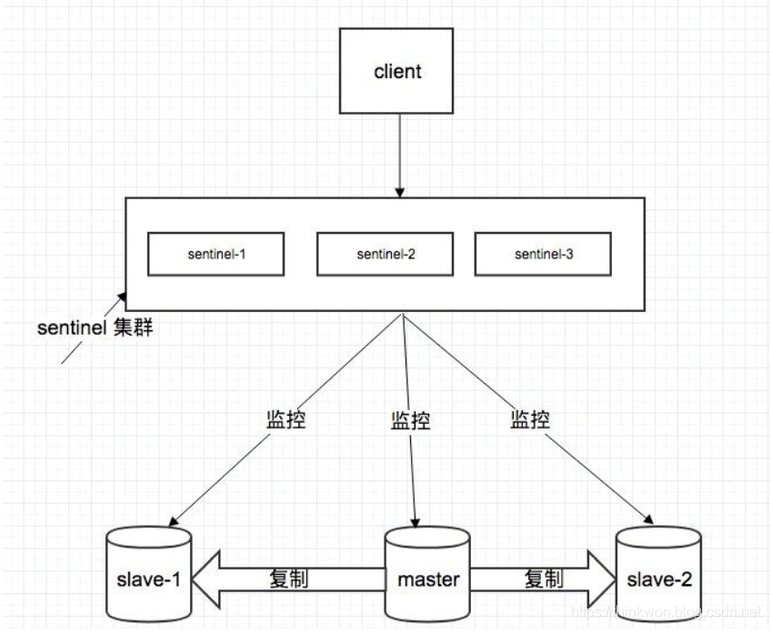

# Redis
## Redis优缺点
Redis的数据是存在内存中的，所以读写速度非常快，因此 redis 被广泛应用于缓存方向，每秒可以处理超过10万次读写操作。Redis 也经常用来做分布式锁。除此之外，Redis 支持事务 、持久化、LUA脚本、LRU驱动事件、多种集群方案。

优点：
- 读写性能优异，Redis能读的速度是110000次/s，写的速度是81000次/s
- 支持数据持久化，AOF和RDB两种持久化方式
- 支出事务，Redis所有操作都是原子性的
- 数据结构丰富，除了支持String类型外，还支持hash、set、zset、list等数据结构
- 支持主从复制，主机会自动将数据同步到从机，可以进行读写分离

缺点：
- 数据库容量受物理内存限制，不能用作海量数据的高性能读写，使用场景局限于较小数据量的高性能操作和运算
- 不具有自动容错和恢复功能，主机从机宕机会导致前端部分读写请求失败，需要等待机器重启或者手动切换前端的IP才能恢复
- 主机宕机，宕机前游部分数据未能及时同步到从机，切换IP后会引入数据不一致性问题，降低系统可用性
- Redis较难支持在线扩容，在容量达到在线扩容会变得很复杂，因此在上线时必须确保有足够的空间，这样会对空间造成很大的浪费

## Redis应用场景
- 计数器
- 缓存(会话缓存，全页缓存)
- 查找表
- 消息队列(不推荐)
- 分布式锁
## 数据类型
|数据类型|可以存储的值|应用场景|
|String|字符串、整数或者浮点数| 适合最简单的k-v存储，类似于memcached的存储结构，短信验证码，配置信息等|
|List|列表|因为list是有序的，比较适合存储一些有序且数据相对固定的数据。如省市区表、字典表等，类似粉丝列表，文章的评论列表|
|Set|无序集合|可以简单的理解为ID-List的模式，如微博中一个人有哪些好友，set最牛的地方在于，可以对两个set提供交集、并集、差集操作，比如交集，可以把两个人的粉丝列表整一个交集|
|Hash|包含键值对的无序散列表|一般key为ID或者唯一标示，value对应的就是详情了。如商品详情，个人信息详情，新闻详情等|
|Zset|有序集合|去重但可以排序，如获取排名前几名的用户|
## 持久化方式
Redis 提供两种持久化机制 RDB（默认） 和 AOF 机制.当两种方式同时开启时，数据恢复Redis会优先选择AOF恢复。
### RDB
RDB：是Redis DataBase缩写快照，是Redis默认的持久化方式。按照一定的时间将内存的数据以快照的形式保存到硬盘中，对应产生的数据文件为dump.rdb。
优点：
- 只有一个文件dump.rdb，方便持久化
- 容灾性号，一个文件可以保存到安全的磁盘
- 性能最大化，fork子进程赖完成写操作，主进程继续处理命令
- 相对于数据集大时，比AOF的启动效率更高

缺点：
1. 数据安全性低，RDB时间隔一段时间持久化，如果持久化期间，Redis发生故障，会使得数据丢失。
### AOF
AOF持久化(即Append Only File持久化)，则是将Redis执行的每次写命令记录到单独的日志文件中，当重启Redis会重新将持久化的日志中文件恢复数据。

优点：
- 数据安全，aof 持久化可以配置使得每进行一次命令操作就记录到aof文件中一次
- 通过append模式写文件，即使中途宕机，可以用过redis-check-aof工具解决数据一致性问题
- AOF机制的rewrite模式及，AOF 文件没被 rewrite 之前可以删除其中的某些命令

缺点：
- AOF 文件比 RDB 文件大，且恢复速度慢。
- 数据集大的时候，比 rdb 启动效率低

## 过期键删除策略
可以设置Redis中缓存Key的过期时间
过期策略分为一下三种
- **定时过期*8：每个设置过期时间的key都需要创建一个定时器，到过期时间就会立即清除。该策略可以立即清除过期的数据，对内存很友好；但是会占用大量的CPU资源去处理过期的数据，从而影响缓存的响应时间和吞吐量
- **惰性过期**：只有当访问一个key时，才会判断该key是否已过期，过期则清除。该策略可以最大化地节省CPU资源，却对内存非常不友好。极端情况可能出现大量的过期key没有再次被访问，从而不会被清除，占用大量内存
- **定期过期**：每隔一定的时间，会扫描一定数量的数据库的expires字典中一定数量的key，并清除其中已过期的key。该策略是前两者的一个折中方案

## 内存淘汰策略
Redis的内存淘汰策略是指在Redis的用于缓存的内存不足时，怎么处理需要新写入且需要申请额外空间的数据。
### 全局键空间选择性移除
当内存不足以容纳新写入数据时，会根据策略进行对应的处理
- noeviction：，**新写入操作会报错**
- allkeys-lru：在键空间中，移除最近最少使用的key
- allkeys-random：在键空间中，随机移除某个key

### 设置过期时间的键空间选择性移除
当内存不足以容纳新写入数据时，在设置了过期时间的键空间中，会根据策略进行对应的处理
- volatile-lru：**移除最近最少使用的过期key**
- volatile-random：，**随机移除某个设置了过期时间key**
- volatile-ttl：当**有更早过期时间的key优先移除**

## 线程模型
## 事务
Redis 事务的本质是通过MULTI、EXEC、WATCH等一组命令的集合。事务支持一次执行多个命令，一个事务中所有命令都会被序列化。在事务执行过程，会按照顺序串行化执行队列中的命令，其他客户端提交的命令请求不会插入到事务执行命令序列中。
总结就是**redis事务就是一次性、顺序性、排他性的执行一个队列中的一系列命令**

### 事务的三个阶段
1. 事务开始MULTI：开启一个事务，MULTI执行之后，客户端可以继续向服务器发送任意多条命令，这些命令不会立即被执行，而是被放到一个队列中，当EXEC命令被调用时，所有队列中的命令才会被执行
2. 命令入队
3. 事务执行EXEC：执行所有事务块内的命令。

### 相关命令
事务原语：MULTI、EXEC、DISCARD和WATCH
Redis会将一个事务中的所有命令序列化，然后按顺序执行。
1. redis 不支持回滚
2. 如果在一个事务中的命令出现错误，那么所有的命令都不会执行
3. 如果在一个事务中出现运行错误，那么正确的命令会被执行

- WATCH 命令是一个乐观锁，可以为 Redis 事务提供 check-and-set （CAS）行为。 可以监控一个或多个键，一旦其中有一个键被修改（或删除），之后的事务就不会执行，监控一直持续到EXEC命令
- MULTI命令用于开启一个事务，它总是返回OK。 MULTI执行之后，客户端可以继续向服务器发送任意多条命令，这些命令不会立即被执行，而是被放到一个队列中，当EXEC命令被调用时，所有队列中的命令才会被执行
- EXEC：执行所有事务块内的命令。返回事务块内所有命令的返回值，按命令执行的先后顺序排列。 当操作被打断时，返回空值 nil
- 调用DISCARD，客户端可以清空事务队列，并放弃执行事务， 并且客户端会从事务状态中退出
- UNWATCH命令可以取消watch对所有key的监控
  
## 集群方案
### 哨兵(sentinel)模式

哨兵具有以下功能
- 集群监控：负责监控 redis master 和 slave 进程是否正常工作
- 消息通知：如果某个 redis 实例有故障，那么哨兵负责发送消息作为报警通知给管理员
- 故障转移：如果 master node挂掉了，会自动转移到 slave node上。判断一个 master node 是否宕机了，需要大部分的哨兵都同意才行，涉及到了分布式选举的问题
- 配置中心：如果故障转移发生了，通知 client 客户端新的 master地址

#### 哨兵的核心知识
- 哨兵至少需要 3 个实例，来保证自己的健壮性
- 哨兵 + redis 主从的部署架构，是不保证数据零丢失的，只能保证 redis 集群的高可用性
- 对于哨兵 + redis 主从这种复杂的部署架构，尽量在测试环境和生产环境，都进行充足的测试和演练。

### 服务端路由查询(官方Redis Cluster方案)
Redis Cluster是一种服务端Sharding技术。Redis Cluster并没有使用一致性hash，而是采用slot(槽)的概念，一共分成16384个槽。将请求发送到任意节点，接收到请求的节点会将查询请求发送到正确的节点上执行。

 redis cluster 架构下，每个 redis 要放开两个端口号，比如一个是 6379，另外一个就是加1w的端口号。用于节点通信，进行故障检测、配置更新、故障转移授权，比如16379

#### 过程
1. 通过哈希的方式，将数据分片，每个节点均分存储一定哈希槽(哈希值)区间的数据，默认分配了16384 个槽位
2. 每份数据分片会存储在多个互为主从的多节点上
3. 数据写入先写主节点，再同步到从节点
4. 同一分片多个节点间的数据不保持一致性
5. 读取数据时，当客户端操作的key没有分配在该节点上时，redis会返回转向指令，指向正确的节点
6. 扩容时时需要需要把旧节点的数据迁移一部分到新节点

#### 节点通信
集群元数据的维护有两种方式：集中式、Gossip 协议。redis cluster 节点间采用 gossip 协议进行通信。

## 分区
## 分布式
## 缓存异常
