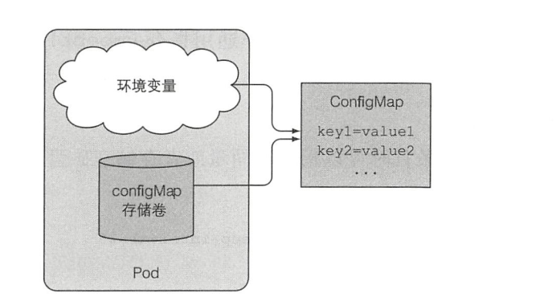
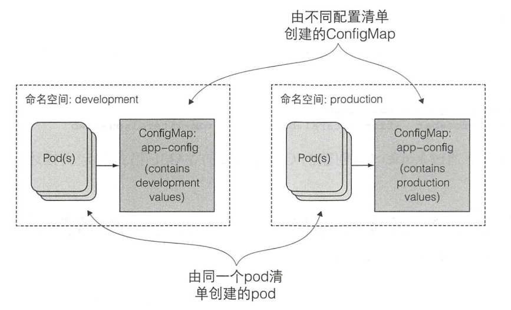
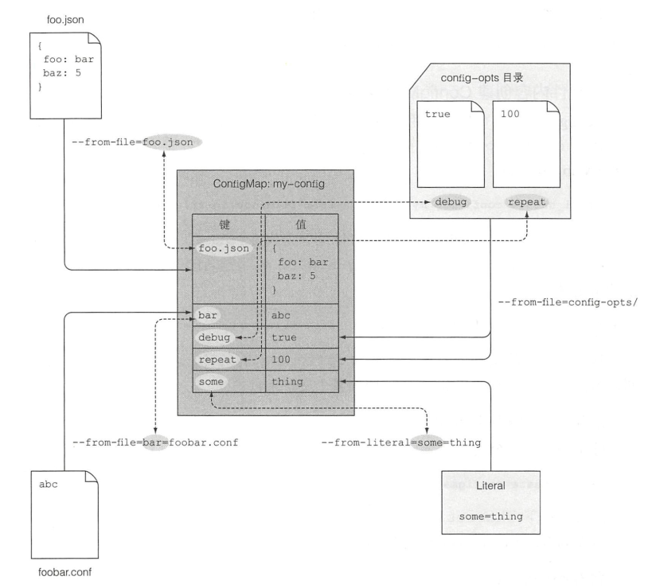
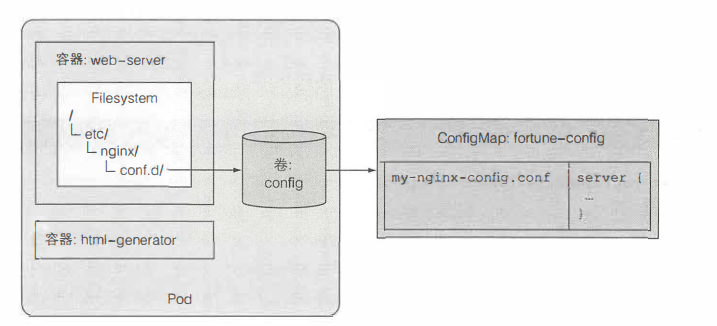
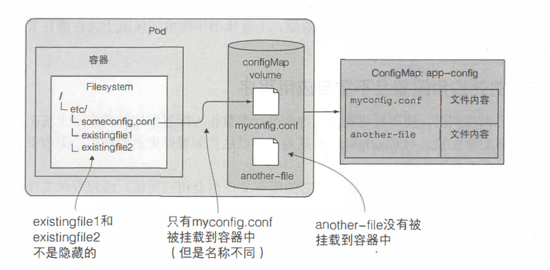

# ConfigMap
**K8s允许将配置选项分离到单独的资源对象ConfigMap中，本质上使一个KV映射**。应用无须直接读取到ConfigMap。映射的内容通过环境变量或者卷文件的形式传递给容器，而非直接传递给容器。
当然，应用程序也可以直接通过kubernetes Rest API按需读取ConfigMap的内容。
ConfigMap通常被用作存储非敏感数据，不过依旧希望仅限于文件拥有者的用户和组可读写。
## ConfigMap存在的意义
ConfigMap的作用使解耦配置。应用配置的关键在于能偶在多个环境中区分配置选项，将配置从应用程序源码中分离，可频繁变更配置值

f

## ConfigMap的创建方式
- 简单创建：kubectl create configmap myConfig --from-literal=sleep-interval=25
- yaml创建：kubectl create -f myConfig.yaml
- 文件内容创建：kubectl create configmap myConfig --from-file=config-file.conf
- 文件夹创建：kubectl create configmap myConfig --from-file=/path/to/dir
- 混合创建： kubectl create configmap myConfig --from-file=/path/to/dir --from-file=my.json --from-file=/path/to/dir

## ConfigMap的使用方式
### ConfigMap条目用作环境变量
#### 单个环境变量
1. 使用Pod中的spec.containers.env.name 表示环境变量
2. 使用spec.containers.env.valueFrom.configMapKeyRef.name 指定ConfigMap。
3. 使用spec.containers.env.valueFrom.configMapKeyRef.key 指定环境变量的值

#### 多个环境变量
我们可以使用spec.containers.enFrom.configMapRef 指定ConfigMap,而环境变量的名称与ConfigMap的键名相同。
### ConfigMap条目用作命令行参数
1. 与使用单个环境环境变量相似
2. 然后通过spec.containers.env.args 引用环境变量
### ConfigMap卷将条目暴露为文件
#### 卷内使用ConfigMap条目volumes
1. 在Pod的spec.volumes.configMap中引入ConfigMap卷
2. 在spec.containers.volumesMounts.mountPath 指明Config卷挂载的位置

#### 卷内暴露指定ConfigMap条目
1. 在Pod的spec.volumes.configMap.items 指明包含卷中的条目
2. 在Pod的spec.volumes.configMap.items.key 指明该键对应的条目文件
3. 在Pod的spec.volumes.configMap.items.path 指明条目的值被储存在该文件中
#### ConfigMap独立条目作为文件被挂载且不隐藏文件夹中的文件
Linux挂在某一文件夹会隐藏该文件夹下的已存在的文件。此时文件夹中只会包含被挂载文件系统的文件，即便使原本文件夹的文件是不可访问也同样如此。

通过spec.container.volumeMounts.subpath字段可以用于挂载卷中的某个独立文件或者使文件夹，而不需要挂载完整卷

#### 为ConfigMap的文件设置权限
默认权限是644，可以使用spec.volumes.configMap.defaultMode修改权限
### 更新应用配置
K8S通过符号链接的方式更新卷。每当ConfigMap被更新后，K8s就会创建一个新文件夹，写入所有文件并更新链接至新的文件夹。

如果挂载的是卷中的单个文件，而不是完整的卷，那么ConfigMap更新后对应的文件不会被更新

