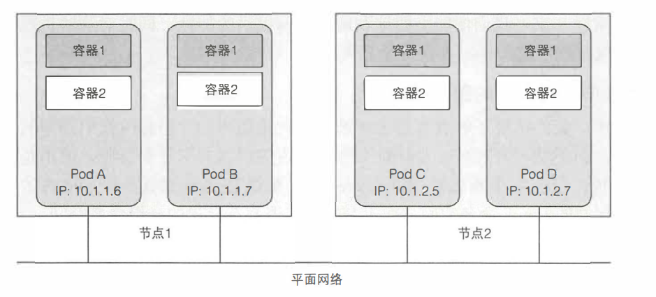
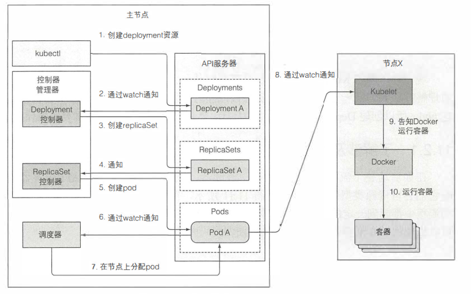

[toc]
# Pod 理解
[kubernetes官网](https://kubernetes.io/docs/concepts/workloads/pods/)是这样描述Pod的:
> Pod 是可以在 Kubernetes 中创建和管理的、最小的可部署的计算单元。它是一组（一个或多个） 容器，容器之间共享存储、网络、以及怎样运行这些容器的声明。Pod中的内容总是共置在一起、共享同一个上下文和共同被调度。

从定义中我们可以引申出
1. Pod本质上就是容器的集合，那么为什么kubernetes使用Pod作为创建和管理的最小的单元，而不是直接使用容器呢？
2. 什么时候应该把多个容器放在一个Pod里面，而不是放在不同的Pod里？
3. Pod中有多个容器了，那么Pod中的容器之间如何共享存储和网络的？
4. 既然有Pod并不是单机的，那么Pod与Pod之间是如何通信的？
5. Pod是怎么被管理和调度的？
6. Pod既然是被管理和调度的，那么又是如何保证Pod内服务是正常的运行的？

## 1. Pod存在的意义
为了解决引申出的第一个问题，首先需要知道Pod为什么存在，以及是在什么场景下被设计出来的。也就是如果调度容器可以解决问题的话，为什么还需要使用更高级的抽象Pod呢？

先看看容器有什么缺陷。以Docker容器为例，Docker容器本质上就是一个进程，里面运行着我们的应用服务。如果在单个容器里面运行多个不相关的进程，那么保持所有进程运行、管理它们的日志将会是我们的责任。比如进程奔溃的时候记录统一的日志，我们需要自己去区分这些日志数据哪一个进程。

这时候我们就需要对其进行解耦，**不能将多个进程放在单独的容器中，因此我们需要另外一种更高级的结构将容器绑在一起，并将它们作为一个单元进行管理**。这也就是Pod存在的意义。

## 2. 什么时候应该把多个容器放在一个Pod里面，而不是放在不同的Pod里？
回想Pod存在的意义，我们知道Pod是为了将运行多个进程的容器拆分出来，进行解耦。换个角度来说，就是问什么时候我们需要将多个进程放在一个容器里？ 很容易想到就是**耦合度高的服务适合放在同一个Pod**内。
什么情况下耦合度高，比如如下情况：
- 容器之间会发生文件交换等。比如一个写文件，一个读文件。
- 容器之间需要本地通信，比如通过 localhost 或者本地的 Socket
- 容器之间需要发生频繁的 RPC 调用，出于性能的考量，将它们放在一个 Pod 内
- 希望为应用添加其他功能，比如日志收集、监控数据采集、配置中心、路由及熔断等功能

## 3. Pod中的容器之间如何共享存储和网络的？
同一个Pod的容器之间如何共享储存和网络之前，我们得首先明白Pod中的容器是如何隔离的。只有知道它们是如何存储和网络是如何隔离开，才能知道通过怎么样子的方式让他们共享

以Docker容器为例，Docker容器Linux的Namespaces[^Namespaces]技术实现内核资源的隔离。意味着**可以将不同的容器放置在同一个Namespace上面，以达到资源共享的目的**。

Linux提供了8种类型的Namespace，而Docker使用了其中的前6种
|Namespace 名称	|作用|
|----|----|
|Mount（mnt）	|隔离挂载点	|
|Process ID (pid)	|隔离进程 ID	|
|Network (net)	|隔离网络设备，端口号等	|
|Interprocess Communication (ipc)	|隔离 System V IPC 和 POSIX message queues	|
|UTS Namespace(uts)|	隔离主机名和域名	|
|User Namespace (user)|	隔离用户和用户组	|
|Control group (cgroup) Namespace|	隔离 Cgroups 根目录	|
|Time Namespace	|隔离系统时间|

这就意为着我们如果将不同的容器放在同一个Namespaces下，就可以共享挂载点以达到共享存储的目的，可以共享网络设备和端口号以达到共享网络的目的。

## 4. Pod与Pod之间是如何通信的？
先看看Pod内容器时如何通信的
### Pod内网络通信
Pod内的容器都运行在同一个Namespaces中，因此只要容器不使用同一个端口号，就可以通过localhost和端口号和其他容器进行通信

### Pod之间网络通信
Pod内使用不同的端口号和localhost，而kubernetes本身设计网络的结构时平坦的。因此每个Pod可以通过其他Pod的IP来实现相互访问。

## 5. Pod是怎么被管理和调度的？
在管理Pod之前，我们得先知道如何区分Pod？必然每个Pod都有自己的ID，但是仅仅只有ID的话，我们并不能获取到有用的信息去组织Pod，K8S使用了标签(Label)去处理这个问题。**通过标签，就很容易通过Label去识别哪一些Pod是属于同一组**。

区分了不同的Pod以后，就要可以对不同的Pod进行管理，kubernetes提供了更高级的抽象结构对Pod进行操作。通过Pod创建的调用链可以知道，ReplicatSet/ReplicatController 直接对Pod进行操作，而在此之上还有Deployment。**总的来说Pod就是被更高级的资源来管理，这些资源通过变更对应Pod的配置来决定Pod部署、版本更新、回滚、横纵伸缩以及调度方式**。

## 6. 如何保证Pod内服务是正常的运行的？
在保证Pod如何运行之前，需要先判断Pod是不是正常的。**kubernetes通过一个存活探针来判断服务是否时正常的**。探针会每隔一段时间请求配置特定路径的URL，根据返回结果与预设结果的比较。来判断应用是否正常。如果不正常，会重启该Pod。（*Note：毕竟重启可以解决80%的问题*）

## Reference
- [1] [kubernetes官网](https://kubernetes.io/)
- [2] [Kubernetes in Action](https://www.manning.com/books/kubernetes-in-action)
- [3] [Kubernetes学习指南](https://www.k8stech.net/k8s-book/)
- [4] [Linux_namespaces](https://en.wikipedia.org/wiki/Linux_namespaces)

[^Namespaces]:Namespaces允许一个进程以及它的子进程从共享的宿主机内核资源（网络栈、进程列表、挂载点等）里获得一个仅自己可见的隔离区域

