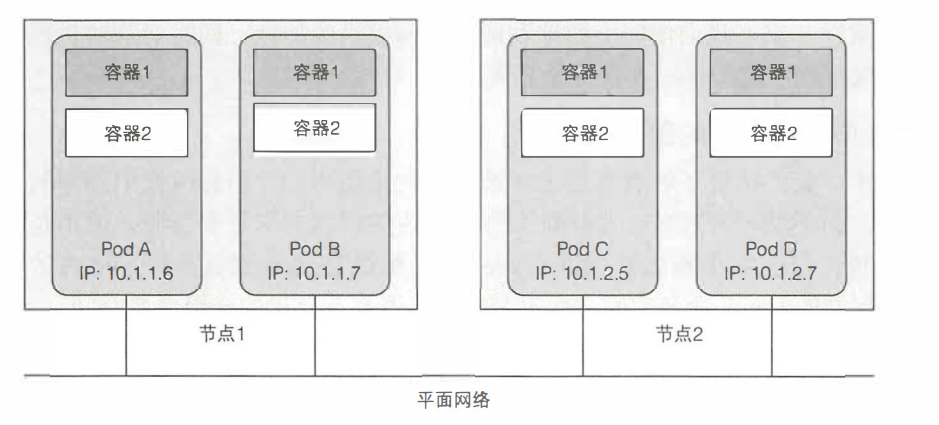

# Pod
Pod 由一个或多个容器组成。是k8s在容器基础上做了更高层次的抽象。Pod 中的容器不可分割，会作为一个整体运行在一个 Node 节点上，也就是说 Pod 是你在 Kubernetes 中可以创建和部署的最原子化的单位。
本质上Pod类似与一个逻辑主机。而容器则是主机内的进程。

### 特性
同一个 Pod 中的容器共享网络、存储资源。
- 每个 Pod 都会拥有一个独立的网络空间，其内部的所有容器都共享网络资源，即 IP 地址、端口。内部的容器直接通过 localhost 就可以通信。
- Pod 可以挂载多个共享的存储卷（Volume），这时内部的各个容器就可以访问共享的 Volume 进行数据的读写。

### 产生原因
不能将多个进程聚集在一个单独的容器中，因此需要一种更高级的结构将容器绑定在一起，并将它们作为一个单元进行管理。

### Pod的设计理念
#### 为什么多个容器要比单个容器要好
1. 容器被设计为每个容器只运行一个进程(除非是进程本身产生的子进程)
2. 如果在单个容器里面运行多个不相关的进程，那么保持所有进程运行、管理它们的日志将会是我们的责任

#### 为什么k8s不直接管理容器，而由pod来管理？
使用一个新的逻辑对象 Pod 来管理容器，可以在不重载容器信息的基础上，添加更多的属性，而且也方便跟容器运行时进行解耦，兼容度高。
比如
- 存活探针（Liveness Probe）可以从应用程序的角度去探测一个进程是否还存活着，在容器出现问题之前，就可以快速检测到问题
- 容器启动后和终止前可以进行的操作，比如，在容器停止前，可能需要做一些清理工作，或者不能马上结束进程
- 定义了容器终止后要采取的策略，比如始终重启、正常退出才重启等

#### 为什么要允许一个 Pod 内可以包含多个容器？
用一个 Pod 管理多个容器，既能够保持容器之间的隔离性，还能保证相关容器的环境一致性。使用粒度更小的容器，不仅可以使应用间的依赖解耦，还便于使用不同技术栈进行开发，同时还可以方便各个开发团队复用，减少重复造轮子

### 原理
#### 隔离原理
Pod通过配置Docker让一个Pod内的所有容器共享linux的命名空间，而不是每个容器都有自己的命名空间

#### 网络通信
##### Pod内
同一个Pod下的容器运行在相同的Network命名空间。因此同一个Pod下的容器运行的多个进程需要注意不能绑定在同一个端口号。

##### Pod之间
所有的Pod都在同一个共享网络地址中，因此每个Pod都可以通过其他Pod的IP来实现相互访问。Pod之间的网络是平坦的

### 一个pod内运行多个容器的使用场景
Pod之间应该包含紧密耦合的容器组
- 容器之间会发生文件交换等。比如一个写文件，一个读文件。
- 容器之间需要本地通信，比如通过 localhost 或者本地的 Socket
- 容器之间需要发生频繁的 RPC 调用，出于性能的考量，将它们放在一个 Pod 内
- 希望为应用添加其他功能，比如日志收集、监控数据采集、配置中心、路由及熔断等功能

### Pod 的重启策略
- Always 表示一直重启，这也是默认的重启策略。Kubelet 会定期查询容器的状态，一旦某个容器处于退出状态，就对其执行重启操作；
- OnFailure 表示只有在容器异常退出，即退出码不为 0 时，才会对其进行重启操作；
- Never 表示从不重启；

### Pod 中的健康检查
Kubernetes 中提供了一系列的健康检查，可以定制调用，来帮助解决类似的问题，我们称之为 Probe（探针）
- livenessProbe可以用来探测容器是否真的在“运行”，即“探活”。如果检测失败的话，这个时候 kubelet 就会停掉该容器，容器的后续操作会受到其重启策略的影响。
- readinessProbe常常用于指示容器是否可以对外提供正常的服务请求，即“就绪”，比如 nginx 容器在 reload 配置的时候无法对外提供 HTTP 服务。
- startupProbe则可以用于判断容器是否已经启动好，就比如上面提到的容器启动慢的例子。我们可以通过参数，保证有足够长的时间来应对“超长”的启动时间。 如果检测失败的话，同livenessProbe的操作

### Pod的定义
- metadata：包括名称、命名空间、标签和关于该容器的其他信息
- spec：包含Pod内容的实际说明，如Pod的容器、卷和其他数据
- status：包含运行中的Pod的当前信息，如Pod所处的条件，每个容器的描述和状态，内部IP等