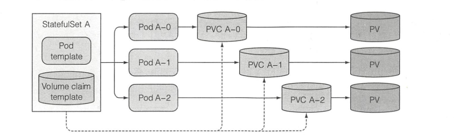

# StatefulSet
## StatefulSet存在的意义
ReplicaSet创建的多个pod副本之间，除了名字和IP地址不同以外，没有其他差异。意味着ReplicaSet的所有副本都共享一个持久卷声明，也就是绑定到同一个持久卷。
而Stateful资源用于代替ReplicaSet，专门定制每一个实例都是不可替代的个体的应用，使其都有用稳定的名字和状态。

## StatefulSet和ReplicaSet的对比
ReplicaSet是用来管理无状态的应用的，而StatfulSet是用于有状态的应用的。
StatefulSet保证了pod被调度后保留它们的表示和状态，方便扩容和缩容。StatefulSet也是通过pod模板创建的，但是他创建的副本并不完全一致，每个pod都可以拥有独立的数据卷，同时提供稳定的网络标识

## StatefulSet如何保证同样的网络标识
与无状态的pod不一样，有状态的pod需要通过主机名来定位。因此有StatefulSet创建的时候需要创建一个用来记录每个pod网络标记的headless Service，这样每个pod都会拥有独立的DNS记录，保证集群中的伙伴或者客户端能通过主机名访问它。

## StatefulSet的缩容策略
StatefulSet会优先删除最高索引值的实例，同时StatefulSet在有实例不健康的情况下是不允许进行缩容操作的。

对于缩容操作，只会删除一个pod，而**遗留下之前创建的声明**，一个持久卷声明如果被删除的话，则其上面的数据就会跟着消失。因此，如果需要释放持久卷的话，需要手动删除对应的持久卷声明。

## StatefulSet如何为不同的pod实例提供稳定的专属存储
StatefulSet可以拥有一个或者多个卷的声明模板，这些持久卷声明会在创建pod前创建出来，并绑定在一个pod实例上。
当因为错误缩容后，可以通过扩容操作恢复。因为缩容并不会删除持久卷声明。

