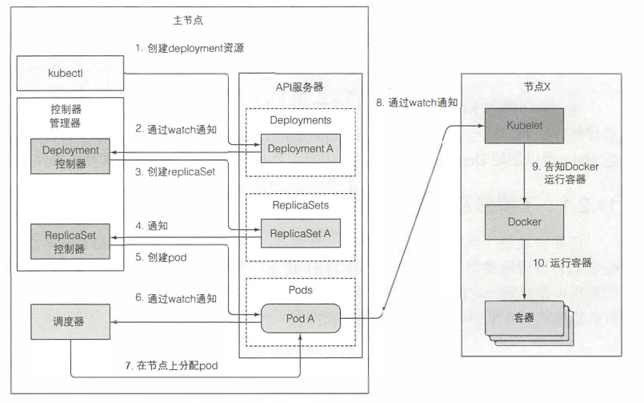

# K8S组件

## 组件间如何通信
- k8s系统组件间只能通过API服务器通信，它们之间不会直接通信
- API服务器是和etcd通信的唯一组件。其他组件不会直接和etcd通信

## 高可用
尽管工作节点的组件都要运行在同一个节点上，控制平面的组件可以被简单地分割在多台服务器上，主节点地每个组件会有多个实例。etcd和API服务器的多个实例可以并行工作，但是调度器和控制管理器在给定时间内只有一个实例起作用，其他实例都处于待命模式

## kubernetes如何使用etcd
k8s将所有创建的对象持久化存储到某个地方，而这个地方就就是etcd。etcd是一个响应快、分布式的一致性key-value存储。只有API服务器才能直接和etcd的优点，其他组件只能通过API服务器间接的读写etcd数据库。
### 只有API服务器才能直接和etcd的优点
- 增强乐观锁、验证系统的健壮性
- 将实际存储机制从其他组件分离，未来替换也方便一些

### 如何确保分布式数据库etcd的一致性
etcd使用RAFT一致性算法来保证这一点，确保在任何时间点，每个节点的状态要么是大部分当前的状态，要么就是之前确认过的状态。

### 为什么etcd实例数量应该为奇数
由于Raft算法在做决策时需要超半数节点的投票，所以etcd集群一般推荐奇数节点，如3、5或者7个节点构成一个集群。

偶数节点虽然多了一台机器，但是容错能力是一样的，也就是说，你可以设置偶数节点，但没增加什么能力，还浪费了一台机器。同时etcd 是通过复制数据给所有节点来达到一致性，因此偶数的多一台机器增加不了性能，反而会拉低写入速度。
https://blog.csdn.net/u013256816/article/details/113153693
https://zhuanlan.zhihu.com/p/32052223

## API服务器
### API服务器做了什么
- 通过认证插件认证客户端: 通过配置在API服务器上的一个或者多个认证插件实现。API会轮流调用这些插件，直到确认谁发送了该请求。这个是通过抽取客户端证书或者HTTP头获取的。插件会抽取客户端的用户名，用户ID，归属组等
- 通过授权插件授权客户端：通过配置在API服务器上的一个或者多个授权插件实现。它们的作用时决定认证的用户是否可以对请求资源执行操作。
- 通过准入控制插件验证AND/OR修改资源请求：如果时要修改、删除或者创建资源，请求就需要经过准入控制插件。**Kubernetes 的许多高级功能都要求启用一个准入控制器**，以便正确地支持该特性。 因此，没有正确配置准入控制器的 Kubernetes API 服务器是不完整的，它无法支持你期望的所有特性

### API服务器如何通知客户端资源变更
客户端通过创建到API服务器的HTTP连接来监听变更。通过此链接，客户端会接收到监听对象的一系列变更通知。

## 调度器
调度器利用API服务器监听的机制等待新建pod，然后给每个新的，没有节点集的pod分配节点。调度器通过通知kubelet创建节点，其本身并不操作pod
### 查找复合条件的节点
- 节点是否能满足pod对硬件资源的需求
- 节点是否资源耗尽
- 节点是否要求被调度到指定的节点
- 节点是否要求绑定到特定的主机端口
- 如果pod有要求特定类型的卷，该节点是否能为此pod加载此卷
- pod是否能偶容忍节点的污点
- pod是否定义了节点、pod的亲缘性和非亲缘性规则

## 控制器
控制器通过API服务器监听资源变更，对变更执行操作。将资源的实际状态调整为期望状态。每种资源都有一种对应的控制器

### 控制器如何协作
控制器通过事件链的方式进行合作。下面时创建deployment时的过程。

## kubelet
kubelet负责所有运行在工作节点上的内容组件
- 它的第一个任务就是在API服务器中创建一个Node资源来注册该节点
- 然后需要持续监控API服务器是否把该节点分配给pod，然后启动pod
- 其也是运行容器存活探针的组件当探针报错的时候，他会重启容器。
- pod从API服务器删除时，kubelet终止容器，并通知服务器pod已经被终止

## kube-proxy
kube-proxy用于确保客户端可以通过kubernetes API 连接到你定义的服务，确保对服务IP和端口的连接最终能到达支持服务的某个pod处。如果有多个pod，它会发挥负载均衡的作用。
kube-proxy除了监控API对service的更改，也监控对endpoint的更改

### 代理模式
- userspace代理模式

- iptables代理模式
