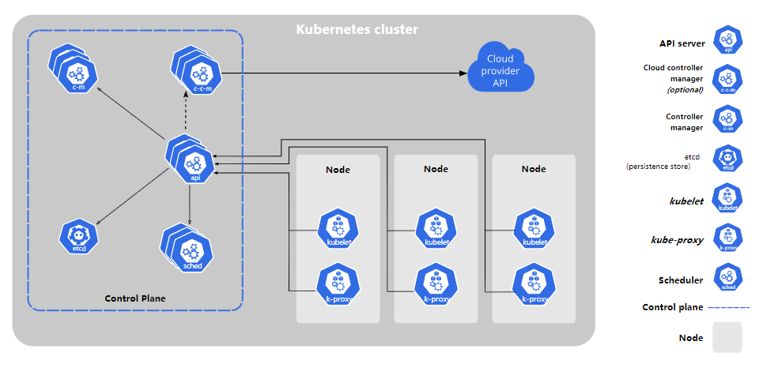
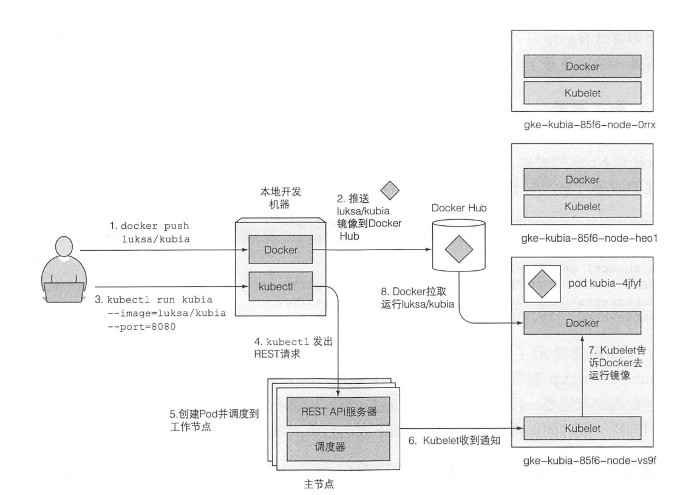

# K8S
## K8S架构

K8S集群由多个节点组成，这些节点被分为两种类型
- 主节点：承载K8S控制和管理整个集群系统的控制面板
- 工作节点：运行着用户实际部署的应用

### 主节点：控制面板(Control Plane Components)
控制平面用户控制集群，对集群做出全局决策(比如调度)，以及检测和响应集群事件。
它包含多个组件，组件可以运行在单个节点或者通过副本运行在多个主节点来保证高可用。

其中组件包括：
- Kubernetes API server: 该组件公开了 Kubernetes API。 API 服务器是的前端
- Scheduler：调度应用
- Controller manager：执行集群级别的功能，如复制组件、持续跟踪工作节点、处理失败节点。
- etcd：可靠分布式数据库，能持久化存储集群配置
- Cloud Controller Manager(Optional)：云控制器管理器是指嵌入特定云的控制逻辑组件。 允许您链接聚合到云提供商的应用编程接口中， 并分离出相互作用的组件与您的集群交互的组件。

### 工作节点：Node
工作节点是运行容器化应用的机器。维护运行的 Pod 并提供 Kubernetes 运行环境。
其中组件包括：
- 容器运行时（Container Runtime）：Docker、rtk或其他容器类型
- Kubelet：一个在集群中每个节点（node）上运行的代理。与API server进行通信，并管理它所在节点的容器。
- Kubernetes Service Proxy(kube-proxy)：集群中每个节点上运行的网络代理。负责组件之间的负载均衡网络。

## K8S的优势
- 简化应用部署
- 更好地利用硬件
- 健康检查和自修复
- 自动扩容
- 简化应用部署

## K8S部署过程

