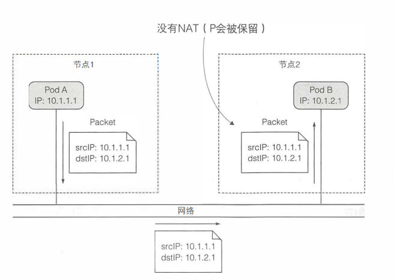
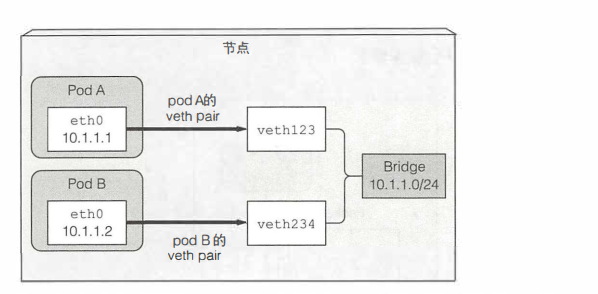
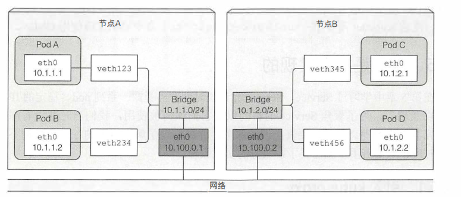

# k8s 网络
## 跨pod网络
pod用于同通信的网络必须是：pod自己认为的IP地址一定和所有其他节点认为该pod拥有的IP地址一致

k8s规定pod之间必须通过非NAT网络进行连接。

### 同节点pod通信
在同一个节点上的pod通过虚拟Ethernet接口连接到同一个桥接来达到pod之间的通信

### 不同节点的pod通信
不同节点的pod，可以通过overlay或者underlay网络或者是常规路由进行通信。

但连接到相同的网关、之间没有任何路由的时候有效。否则，路由器会扔包，因为IP是私有的。虽然能通过配置路由的方式解决，但是随着节点数增加，配置会变得非常困难。
最终可以通过SDN(软件定义网络)解决这个问题。