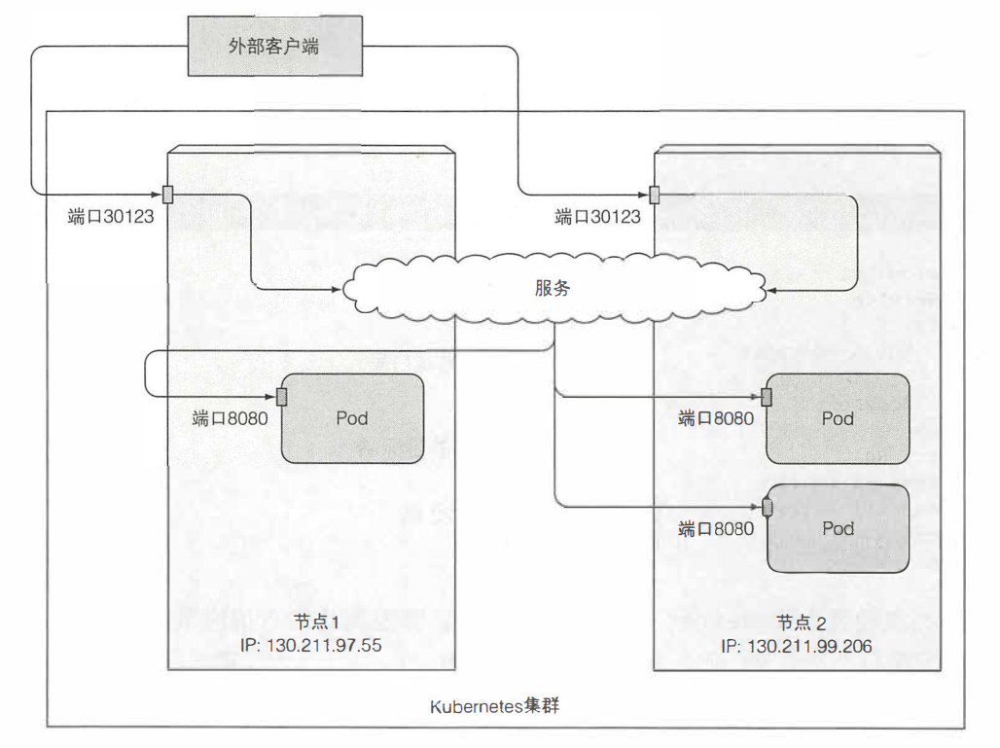
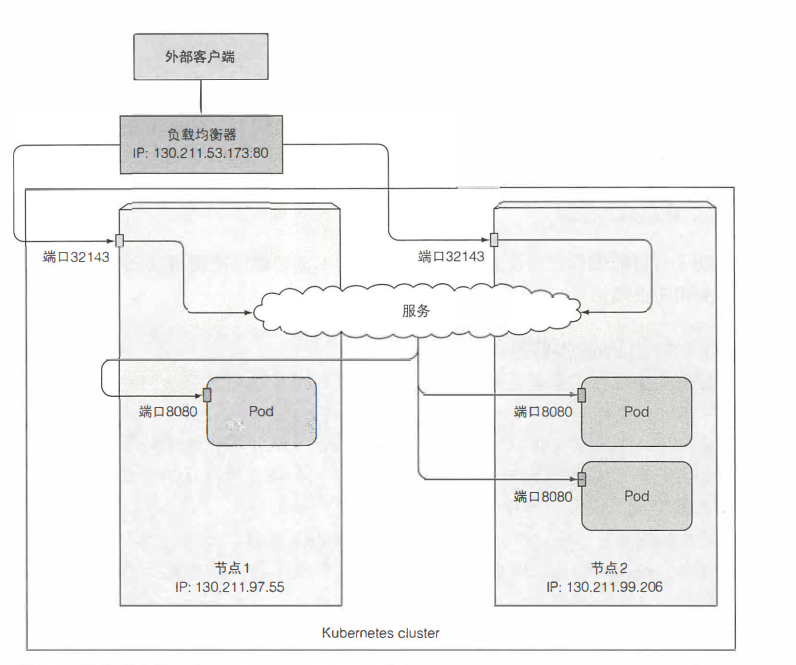
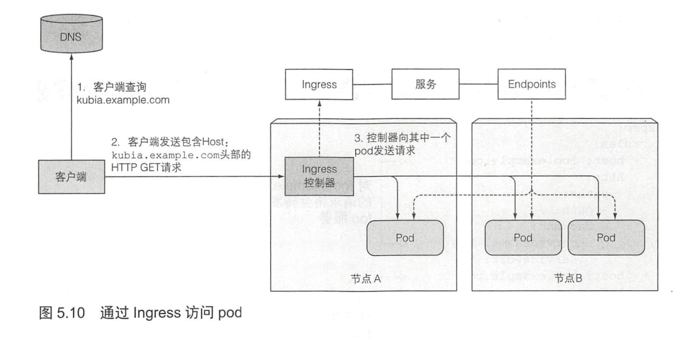
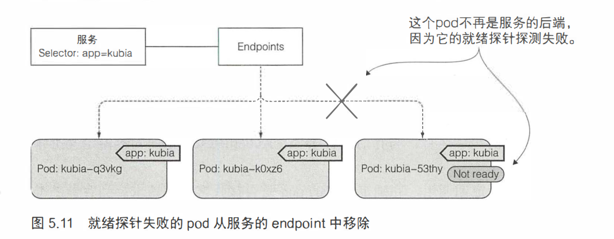
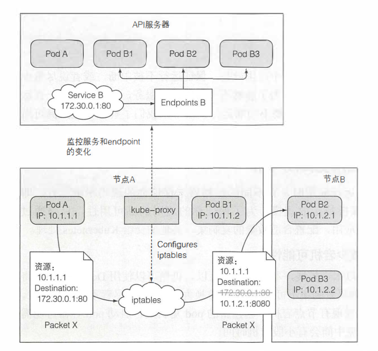

# 服务
**K8S服务是一种为一组功能相同的pod提供单一不变的接入点的资源**。当服务存在时，它的IP地址和端口不会改变。客户端通常通过该IP和端口使用服务。IP地址时虚拟的，没有分配给任何网络接口。
服务分为对内服务（内部集群访问服务）和对外服务（连接集群外部的服务）

客户端通过IP地址和端口好建立连接，这些连接会被路由到提供该服务的任意一个pod上。这样客户端就不需要知道每个单独提供服务的pod的地址。
## 服务存在的意义
1. pod需要一种寻找其他pod的方法来使用其他pod提供的服务，然而pod是短暂，随时会启动和关闭。因此无法在用户端文件中明确指明服务的精确的IP地址或者主机名来配置每个客户端的应用
2. k8s在pod启动前会给已经调度到节点上的pod分配IP地址，因此客户端不能提前知道提供服务的地址
3. 水平伸缩意为多个pod可能会提供相同的服务，每个pod都有自己的IP地址，而客户端无需关心后端体哦那个服务的pod数量以及各自对应的ip地址。

## 内部集群访问服务
### 向服务发送请求的方法
- 创建一个pod，它将请求发送到服务的集群IP并记录响应。可以通过查看pod的日志检查服务的响应
- 使用ssh远程登录到其中一个k8s节点上，然后使用curl命令
- 通过kubectl exec命令在一个已经存在的pod中执行curl命令

### 在容器中远程执行命令
``` shell
kubectl exec hello-minikube-69485c8fcc-zgknv -- curl -s http://10.104.111.222
```
"--"双横杆代表这kubectl命令结束，其后面的内容是pod内部执行的命令
命令运行的过程：


### 会话亲和性
可以通过设置sessionAffinity：ClientIP 来指定客户端产生的所有请求每次都指向同一个pod

## 服务发现
#### DNS 服务发现
#### FQDN（全限定域名）连接服务

## 连接集群外部的服务
### endpoint
服务和pod之间并不是直接相连的。而是通过endpoint相连。
**Endpoint资源就是暴露一个服务的IP地址和端口的列表**

### 将服务暴露给外部客户端的方式
- 将服务的类型设置为NodePart
- 将服务的类型设置为LoadBalance
- 创建一个Ingress资源

#### NodePort类型的服务
创建NodePart服务，可以让k8s在其所有节点上保留一个端口(所有节点都使用相同的端口号)，并将传入的连接转发给作为服务部分的Pod。



#### LoadBalance类型的服务
LoadBalance服务是NodePort服务的扩展。负载均衡器拥有自己独一无二的可公开访问的IP地址，并将所有连接重定向到服务。可以通过负载均衡器的IP地址访问服务。


#### Ingress
##### Ingress产生的意义
当使用LoadBalance服务的时候，每个LoadBalance服务都需要自己的负载均衡器，以及独立的共有IP地址。而Ingress只需要一个公网IP就能为许多服务提供访问，当客户端向Ingress发送请求的时候，Ingress会根据请求的主机名和路径决定请求转发到的服务。

##### Ingress的工作原理
Ingress控制器不会将请求转发给该服务，而是用它来选择一个pod


##### Ingress处理TLS传输
客户端到Ingress的通信时加密的，而控制和后端的pod之间的通信则不是。运行在pod上的应用不需要支持TLS。因此如果web服务器在pod内运行，它只能收到HTTP请求，并让Ingress控制器负责处理和TLS相关的所有内容。
而要使控制器能这么做，需要将证书和私钥附加到Ingress。

## 就绪探针
### 就绪探针存在的意义
Ingress会将请求发送到pod，如果这个pod没有准备好，那么就无法处理请求。这个pod可能需要时间加载配置或数据，或者可能需要执行预热过程以防止第一个用户请求太长影响体验。
就绪探针的作用就是让Ingress认为pod是否准备好接受请求
### 就绪探针的类型
- EXEC探针
- HTTP GET探针
- TCP socket探针

### 探针的操作
就绪探测器会定时调用，并确定特定的pod是否接受客户端亲求，当容器的准备就绪探测返回成功的时候，表示容器已经准备好接受请求。而这一个就绪状态的判定使应用程序开发人员的责任。

与存活探针通过杀死异常的容器并用新的容器来保持pod正常工作不同。容器若没有通过就绪检查，则不会被终止或者重新启动。而是将该容器从端点对象中移除，使连接该服务的客户端不会被重定向到这个pod。


### 探针的实际作用
- 务必定义就绪探针：如果没有就绪探针，新添加的pod立马就会成为服务端点。服务启动但是尚未准备好接受请求连接时，将会看到连接被拒绝类型的错误。
- 不要将停止pod的逻辑加入到就绪探针中：只要删除了容器，k8s将会从服务中删除该容器

## 无法访问pod的trouble shooting 
1. 确保集群内连接到服务的集群IP
2. 不要通过ping服务IP来判断服务是否可访问
3. 如果定义了就绪探针，确保它返回成功
4. 确保某个容器时服务的一部分，确保其在endpoint里
5. 如果通过FQDN访问服务不起作用，看看是否可以使用集群IP而不是FQDN来访问服务
6. 检查是否连接到服务公开的端口，而不是目标端口
7. 尝试直接连接pod IP 以确认pod正在接受正确端口上的连接
8. 如果无法通过pod的IP访问应用，确保应用不是仅半丁本地主机

## 服务时如何实现的？
1. 当API服务中创建一个新的service的时候，虚拟的IP地址就会分配给它。
2. 之后很短之间内，API服务器就会通知所i有运行在工作节点上的kube-proxy客户端有一个新的service被创建。
3. 每个kube-proxy会让该服务在自己运行的节点上可寻址。kube-proxy会配置一些iptables规则处理数据包，内核确保每个目的地的IP/端口对的数据包被解析，目的地址被修改。
*Note:kube-proxy除了监控API对service的更改，也监控对endpoint的更改*

