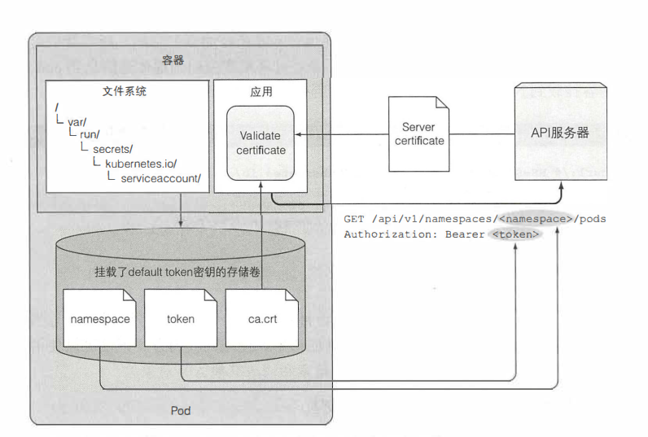
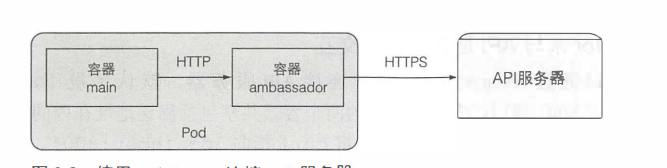
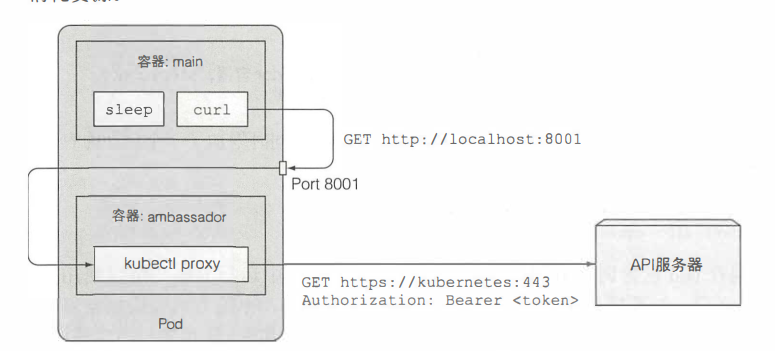

# Downward API
## Downward API存在的意义
对于Pod、运行前的预设的数据，我们可以通过ConfigMap和Secret卷或者环境变量进行设置。但是对于一些不能预先知道的数据，比如pod的IP、主机名或者使pod自身的名称、pod的标签和注解等是不可行的。Downward API 允许我们通过环境变量或者文件(downwardAPI卷)传递pod的元数据，同时将**元数据与数据分离**

## 使用方式
- 通过环境变量
- 通过卷

# Kubernetes API
## Kubernetes API 存在的意义
Downward API提供了一种简单的方式，将pod和容器的元数据传递给它们内部运行的进程，但这种方式仅仅可以暴露一个pod自身的元数据，而且只可以暴露部分元数据。

而**通过Kuberneters API，应用可以知道其他pod的信息，甚至是集群的信息**。

## pod 如何与kubernetes交互
1. 应用应该验证API服务器的证书是否是证书机构所签发的。证书在ca.crt文件中
2. 应用应该将它在token文件中持有的凭证通过Authorization标头获取的API服务器的授权
3. 当对pod所在命名空间的API对象进行CRUD操作时，应该是使用namespace文件夹来传递命名空间信息到API服务器

## ambassador容器简化API服务器交互
在ambassador容器里面运行kubectl proxy命令作为代理。而应用容器向代理发送请求，而不是通过直接向API服务发送请求。
这种模式下，将加密，授权，服务器验证的工作交给ambassador容器。应用容器通过http来与ambassador容器交互，而ambassador通过HTTPS来连接API服务器，对应用容器来说，安全问题是透明的。

## 使用客户端与API服务器交互

## 为什么有了Kubernetes API 还需要 Downward API
对于容器来说，有时候拥有自己的信息是很有用的，可避免与 Kubernetes 过度耦合。 Downward API 使得容器使用自己或者集群的信息，而不必通过 Kubernetes 客户端或 API 服务器来获得

## 为什么要将元数据与数据分离
1. 设计简单，管理容易。元数据基于Pod级别，而不是基于容器级别，保证容器挂了而不影响元数据。
2. 容器不是持久的，如果元数据变更，容器之间相互同步元数据比较难处理。
3. 集中放置有利于做热备份

