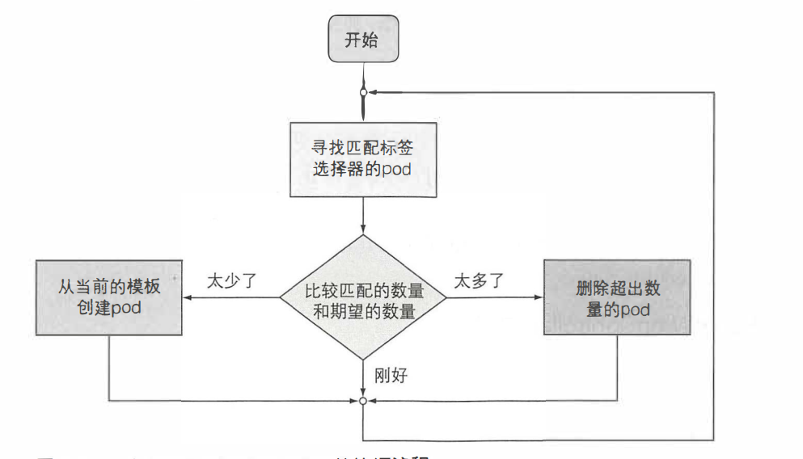

# kubernetes副本机制
## 存活探针(Liveness probe)
K8S能够通过探针检查容器是否正在运行，可以为pod中的每个容器单独指定存活探针，如果探测失败，k8s将定期执行探针并重新启动容器。
重启容器这项任务是由Kubelet执行的，而Kubelet本身是在Node里的，因此如果Node失效，Kubelet将无法执行任何操作。
### K8S探测容器的机制类型
- HTTP GET探针：执行HTTP GET请求，如果收到错误响应状态码或者没有响应，则重启容器。
- TCP套接字探针：和指定端口建立TCP连接，如果建立失败，则重启容器
- Exec探针：在容器内执行任意命令，并检查命令的退出状态码，如果状态码不为0，则重启容器。


### 存活探针创建原则
#### 存活探针应该检查什么
1. 仅仅检查服务器是否相应
2. 一定要检查应用程序内部，而没有任何外部因素的影响，如数据库的影响
#### 保持探针轻量
1. 存活探针不应该消耗太多计算资源。探针的执行频率相对高，必须在1s内执行完毕
#### 无须在探针中实现重试循环
1. 探针的失败阈值时可配置的，并且在容器被终止前探针必须失败多次。

## ReplicationController
### ReplicationController的作用
ReplicationController的作用会持续监控正在运行的pod列表，并保证相应“类型”的pod和期望相符。运行的pod太少，它会根据pod模板创建新的副本。如果pod太多，他将删除多余的副本。
### 组成
- label selector(标签选择器)：用于确定ReplicationController作用域中有哪些pod
- replica count(副本个数)：指定应运行的pod数量
- pod template：用于创建新的pod副本

### 协调流程


### 优点：
- 确保一个pod(多个pod副本)持续运行
- 集群发生故障时，将为故障节点上运行的所有pod创建替代副本
- 轻松实现pod的水平伸缩

## ReplicaSet
### 与ReplicationController区别
两者的行为完全相同，但是ReplicationSet的标签表达能力更强。ReplicationController的标签选择器只允许包含某个标签的匹配pod。
ReplicationSet的标签选择器还允许匹配缺少某个标签的pod，或包含特定标签名的pod。

### 标签选择器
``` yaml
selector:
  matchExpressions:
      - key: app
        operaiton: In
        values:
          - kubia
```
ReplicaSet可以使用matchLabel或者时matchExpressions进行选择。

matchExpressions 有四种类型
- In
- NotIn
- Exists
- DoseNotExist

## DaemonSet
### DaemonSet存在意义
ReplicationController和ReplicaSet都用于k8s集群上部署特定数量的pod，但是不能保证每个节点上都正好运行一个pod实例。比如，希望在每个节点上运行日志收集器和资源监控器，以及k8s自己的kube-proxy进程。
**DaemonSet可以确保一个pod匹配它的选择器并且在每个节点上运行。而不是随机分布在集群上**

## Job
### Job存在的意义
无论时ReplicationController、ReplicaSet还是DaemonSet，都是对持续运行的pod进行管理。它们会持续运行任务，永远达不到完成态。
**Job允许运行一种pod，该pod在内部进程成功结束时，不重启容器，一旦任务完成，pod就会被认为是完成的状态**
Job管理的pod会一直被重新安排，直道成完成任务。

### CronJob
定时的job
Example of scheduled job:
``` yaml
apiVersion: batch/v2alpha1
kind: CronJob
spec:
  schedule: "0 3 * * *"
  startingDeadlineSeconds: 15
  JobTemplate: ...
```
#### 运行方式
CronJob资源会创建Job资源，然后Job资源创建pod。
#### 注意事项
CronJob总是为计划中配置的每个执行创建一个Job。但是可能会同时创建两个Job，或者没有创建。
为了解决第一个问题，你的任务必须是幂等的。对于第二个问题，确保下一个任务运行完成本应该由上一次的(错过的)运行完成的任何工作


