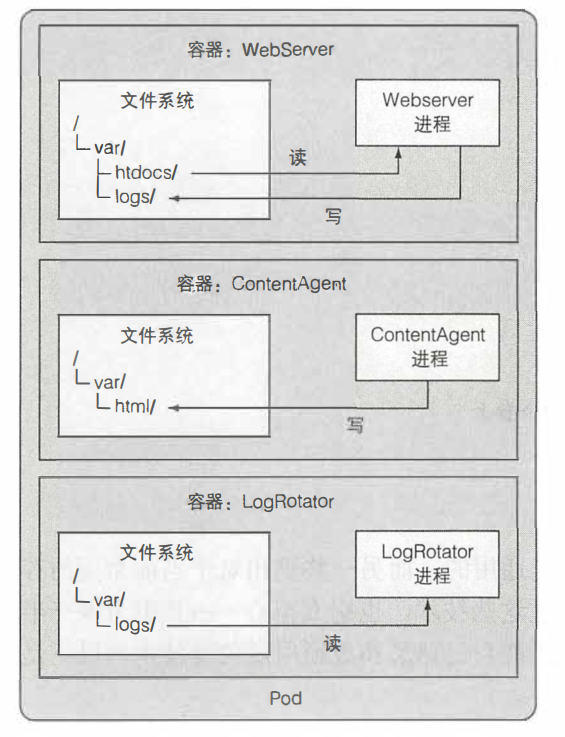
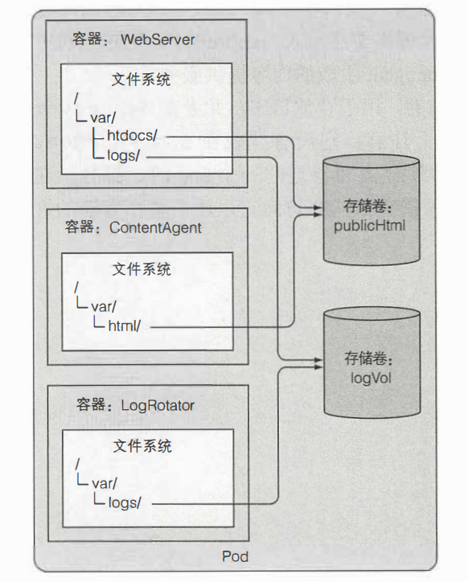
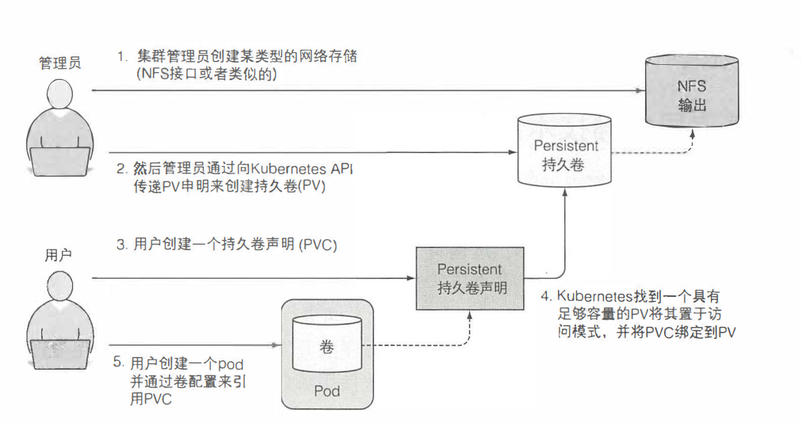
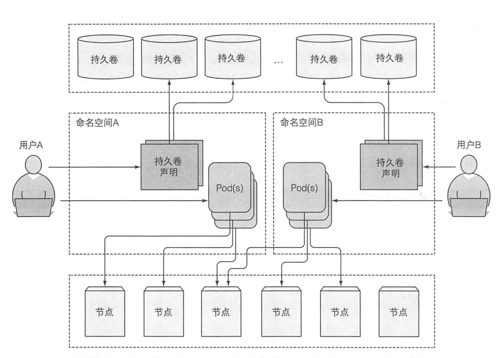
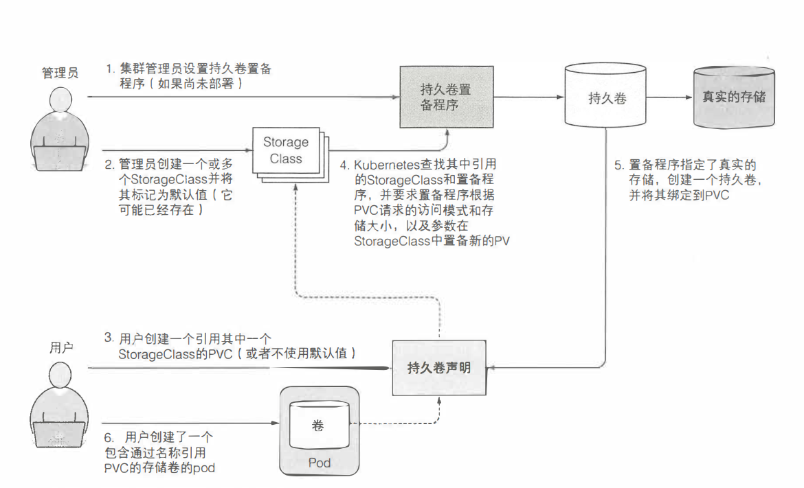

# 卷
**卷是pod的一个组成部分**。它被绑定到pod的生命周期里面，只有pod存在时，才会存在。用于共享pod内的磁盘存储。

## 卷存在的意义
pod中每个容器都有自己独立的文件系统，因为文件系统来自于容器镜像
如果pod中的每个容器在不共享磁盘存储的情况下，用多个容器在一个pod内就没有存在的意义，因为pod里的容器不能相互访问对方的文件。

而K8S里面通过卷来解决这个问题。

## 卷的类型
- emptyDir：用于存储临时数据的简单空目录。非持久的存储
- hostPath：将目录从工作节点的文件系统挂载到pod
- gitRepo：通过检出Git仓库的内容来初始化的卷
- nfs：挂载到pod中的NFS共享卷
- gcePersistentDisk、awsElastic等用于挂载云服务商提供的特定存储类型
- cinder、glusterfs等用于挂载其他类型的网络存储
- configMap、secret、downwardAPI:用于K8S部分资源和集群信息公开为pod的特殊类型券
- persistentVolumeClaim:一种使用预置或者动态配置持久性存储

## 持久卷（PersistentVolume）和持久卷声明（PersistentVolumeClaim）
持久卷不属于任何命名空间，它跟节点一样使集群层面的资源。
当一个持久卷和一个持久卷声明绑定时，这个持久卷不可以被另外一个持久卷声明所绑定和使用

### 持久卷和持久卷声明的意义
K8s中，为了使应用能正常请求存储资源，同时避免处理基础设施细节。因此引入了持久卷和持久卷声明两种资源。

### 持久卷和持久卷声明和底层存储之间的关系

持久卷不属于任何命名空间，它跟节点一样使集群层面的资源。但是持久卷声明使在特定命名空间中创建的，所以持久卷和持久卷声明只能被同一命名空间内的pod创建使用

### PCV访问模式
- RWO:ReadWriteOnce 仅允许单个节点挂载读写
- ROX:ReadOnlyMany 允许多个挂载只读
- RWX:ReadWriteMany 允许多个节点挂载读写

## 动态卷
StorageClass 本质上是一个持久卷的配置，是一个集群级别的资源。为管理员提供了描述存储 "类" 的方法。
在PVC中如果不声明存储类，则使用默认的存储类。可以将spec.storageClassName设置为空字符串""，表示使用手动预先配置的持久卷，而不是动态配置的新PV。

### StorageClass存在的意义
1. 减少了用户对于底层存储资源各方面细节的关注，只需要关注自己创建的PVC资源，引用存储类的对应StorageClass资源即可
2. 集群管理员将从多次创建PV这项工作中解脱出来，只要有了StorageClass资源，PVC创建引用好后，k8s系统会自动为其创建合适的PV，并且将PV和PVC绑定好，从而实现动态的资源供应

### 持久卷动态配置过程

