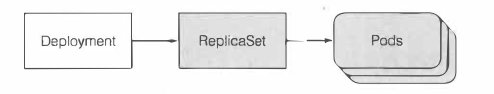

# Deployment 
## Deployment存在的意义
1. 因为使用Kubectl rolling-update 升级是客户端升级。如果中途失去了网络连接，升级进程就会中断。pod和ReplicationController最终会处于中间状态。
2. 使用Deployment可以定义单个Deployment的资源所需要达到的状态，并让kubernetes处理中间的状态。
3. Deployment会创建新的ReplicaSet，但是用户并不需要关系和维护ReplicaSet，所有的操作都是再Deployment上面完成的，和管理多个ReplicationController相比，管理单个Deployment对象容易得多。

## Deployment升级应用过程
### Deployment创建
当Deployment创建的时候，ReplicaSet也会随之创建。在使用Deployment的时候，pod是由ReplicaSet创建和管理的，而不是由Deployment创建和管理的

### Deployment触发升级
通过修改Deployment资源中的Pod模板(字段)，就可以触发deployment的升级。

*Note：如果deployment的pod模板引用ConfigMap或者是Secret，那么更改ConfigMap资源本身不会触发Deployment的升级。如果需要，可以通过创建一个新的ConfigMap，并修改deployment模板引用新的ConfigMap*

当Deployment升级的时候，会创建一个新的ReplicaSet，然后再慢慢扩容。原本旧的ReplicaSet就会慢慢缩容为0,而不是删除。这样做的意义是为了方便Deployment回滚。

### Deployment回滚
因为Deployment保留了旧的ReplicaSet，因此很容易地能做到版本地回滚。旧版本的ReplicaSet过多容易导致ReplicaSet列表过于混乱，因此可以通过spec.revisionHistoryLimit限制历史版本的数量。

### 控制升级的速率
通过spec.strategy.rollingUpdate.maxUnavailable来控制最大不可用的Pod数量
通过spec.strategy.rollingUpdate.maxSurge来控制最大可同时存在pod的数量

### Deployment的升级策略
Deployment的升级策略可以通过spec.strategy指定。
- 滚动更新策略：RollingUpdate
- 重新创建策略：Recreate

## 回滚 Deplyment

## 为什么旧的ReplicaSet不删除
用于版本回滚，可以使用Deployment的revisionHistoryLimit属性限制历史版本的数量

## 应用升级策略
- 滚动更新：程序需要支持两个版本的对外服务。
- 剔除旧版本，再更新新版本：会导致服务短暂不可用。

## 为什么K8S抛弃使用Kubectl rolling-update滚动升级(ReplicationController滚动升级)
kubectl rolling-update 这个方式会直接更新pod和ReplicationController的标签。**更重要的是Kubectl 只是执行滚动升级的客户端**，因此调整ReplicaitonController的副本数，是由客户端执行的。 如果再执行升级的时候kubectl失去了网络连接，升级进程就会中断。pod和ReplicationController最终会处于中间状态。

