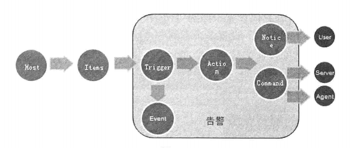

Zabbix-Server 和 Zabbix-Proxy可以通过VPN，SSH,Stunnel连接

## Zabbix监控配置流程
Host Group(主机组) ---> Hosts(主机) ----> Applications(监控项组) ----> Items(监控项) -----> Triggers(触发器) ----> Event(事件) ----> Actions(处理动作) ----> User Groups(用户组) ----> Users(用户) ---->Medias(告警方式) ----> Audit(日志审计)

Items:采集数据
Trigger：对采集的数据进行阈值判断，触发阈值，产生事件
Action：Action对达到阈值的Trigger触发警告

每一个Trigger必须对应一个Item，但是一个Item可以对应多个Trigger
## 监控方式
### Agent监控方式
### Trapper 监控方式
Trapper-Server，采用主动推送的方式。Trapper不需要安装客户端，Key的名称可以灵活定义。
再Trapper工作模式中，Zabbix数据发送的程序时zabbix-sender。
### SNMP监控方式
**用于监控路由器、交换机、打印机、UPS或者其他开始SNMP的设备**
SNMP(Simple Network Managment Protocol) 简单网络管理协议包含两个部分：管理进程和被管理设备。SNMP 使用的时UDP协议，采用161端口发送报文，
管理端和被管理端的通信方式
- 被管理端向管理端发送数据
- 管理端向被管理端请求获取数据
- 管理端向被管理端请求改变数据

SNMP网络管理框架是工业上的现行标准，由3个主要部分组成，分别是管理信息结构SMI（Structure ofManagement Information）、管理信息库MIB和管理协议SNMP。
SNMP是管理进程（NMS）和代理进程（Agent）之间的通信协议

### IPMI 监控方式
IPMI(Intelligent Platform Managerment Interface)，即智能平台管理接口，用于监控服务器的物理特性，如温度、电压、电扇工作状态、电源供应和机箱入侵等。

IPMI独立于CPU BIOS和OS外自行运行，能再缺少操作系统、系统管理软件或者系统关机但有电源的情况下远端管理服务器硬件。

### JMX监控方式
JMX(Java Manager Extensions) Java扩展管理是Java平台为应用程序、设备、系统植入管理功能的架构。

JMX监控数据的获取由专门的代理程序Zabbix-Java-Gateway来负责采集。Zabbix-Java-Gateway 和JMX的Java程序通信获取数据。

## 运维
#### 发现
#### 网络发现
完成的工作：
- 快速发现并添加主机
- 简单的管理
- 随着环境的改变而快速搭建监控系统

网络发现基于的信息：
- IP地址段
- 基于服务的FTP、SSH、Web、POP3、IMAP、TCP等
- 从Zabbix-Agent接收到信息
- 从SNMP agent接收到信息
#### 主动方式的自动注册
Active Agent Auto-Registeration(主动注册功能)主要用于Agent主动且自动的向Server注册

#### Low level discovery
Low level discovery可以对网卡、文件系统、SNMP OIDS进行自动发现。

###
## Trouble
数据断层原因
- 系统负载高
- TCP连接数过多
- 网络问题
- 无法获取到数据
- 数据库无法存储数据