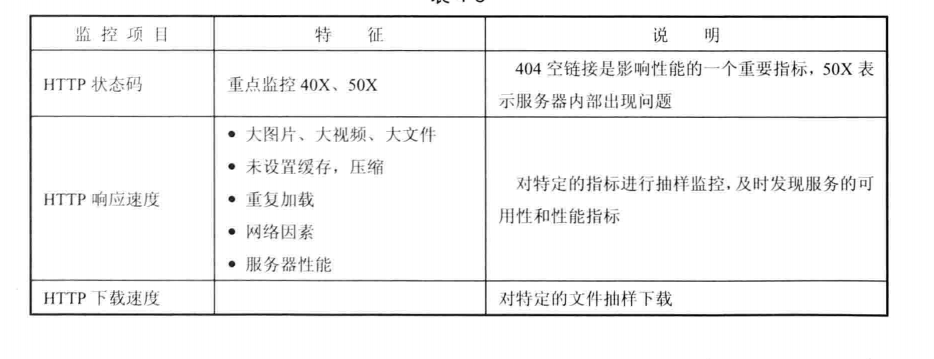
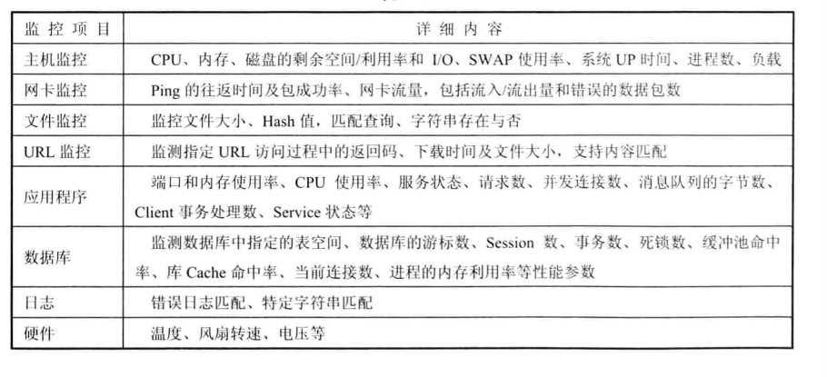

### 监控项目

#### CPU采集项
- cpu.idle：一个或多个CPU空闲且系统没有未完成的磁盘I / O请求的时间百分比。
- cpu.busy：与cpu.idle相对，他的值等于100个cpu.idle。
- cpu.guest：一个或多个CPU运行虚拟处理器所花费的时间百分比。
- cpu.iowait：在系统有未完成的磁盘I / O请求期间，一个或多个CPU空闲的时间百分比。
- cpu.irq：一个或多个CPU服务硬件中断所花费的时间百分比。
- cpu.softirq：CPU花费在服务软件中断上的时间百分比。
- cpu.nice：在具有优先级的用户级别执行时发生的CPU利用率百分比。
- cpu.steal：虚拟机管理程序为另一个虚拟处理器提供服务时，一个或多个虚拟CPU非自愿等待所花费的时间百分比。
- cpu.system：在系统级别（内核）执行时发生的CPU利用率百分比。
- cpu.user：在用户级别（应用程序）执行时发生的CPU利用率百分比。
- cpu.cnt：cpu核数。
- cpu.switches：cpu切换次数，计数器类型。

ref:
- [理解CPU Steal Time](https://zhuanlan.zhihu.com/p/33293033)
- [cpu分析](https://segmentfault.com/a/1190000018471760)

#### 磁盘采集项
- df.bytes.free：磁盘可用量，int64
- df.bytes.free.percent：磁盘可用量占总量的百分比，float64，比如32.1
- df.bytes.total：磁盘总大小，int64
- df.bytes.used：磁盘已用大小，int64
- df.bytes.used.percent：磁盘已用大小占总量的百分比，float64
- df.inodes.total：inode总数，int64
- df.inodes.free：可用inode数目，int64
- df.inodes.free.percent：可用inode占比，float64
- df.inodes.used：已用的inode数据，int64
- df.inodes.used.percent：已用inode占比，float64

- [理解inode](https://www.ruanyifeng.com/blog/2011/12/inode.html)
- [IO分析](https://segmentfault.com/a/1190000018499770)

#### 内存采集项
- mem.memtotal：内存总大小
- mem.memused：使用了多少内存
- mem.memused.percent：使用的内存占比
- mem.memfree
- mem.memfree.percent
- mem.swaptotal：swap总大小
- mem.swapused：使用了多少swap
- mem.swapused.percent：使用的swap的占比
- mem.swapfree
- mem.swapfree.percent

- [内存分析](https://segmentfault.com/a/1190000018553950)

- [性能分析工具集](https://rdc.hundsun.com/portal/article/731.html)

#### Web监控指标

#### 常见性能采集指标

#### 监控文章
[monitoring](https://www.datadoghq.com/blog/monitoring-101-collecting-data/#metrics)